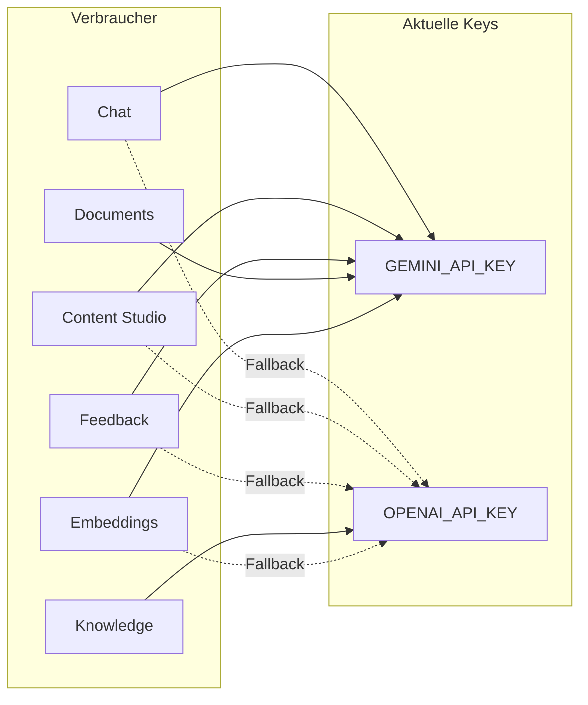
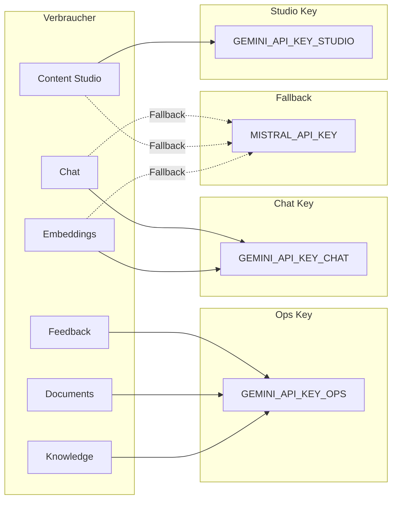
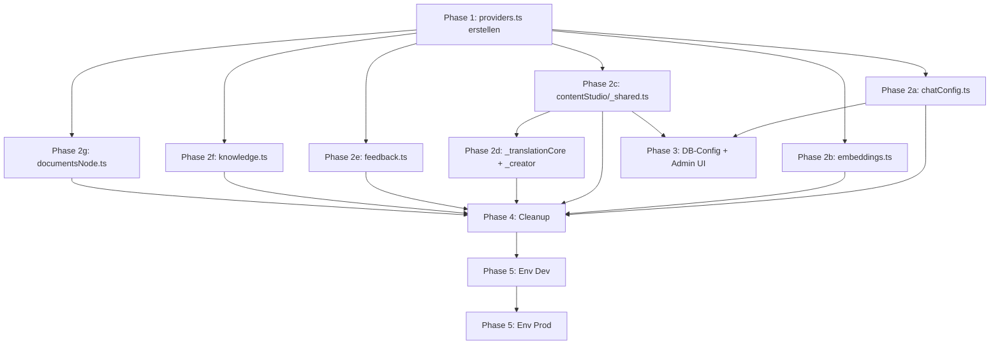

# API Key Refactoring: OpenAI-Abloesung, Mistral-Fallback, Kosten-Separation

## Ist-Zustand

Aktuell teilen sich alle Bereiche **einen** `GEMINI_API_KEY` und **einen** `OPENAI_API_KEY`. OpenAI wird als Fallback und in `knowledge.ts` sogar als einziger Provider genutzt. Es gibt keine Moeglichkeit, Kosten pro Bereich zu tracken.



## Soll-Zustand



Jeder Bereich hat einen **dedizierten Gemini Key** (in der Google Cloud Console separat trackbar). Mistral dient als **einziger Fallback-Provider** fuer alle Bereiche (ein Key reicht, da Fallback selten greift).

**Abwaertskompatibilitaet:** Wenn die spezifischen Keys nicht gesetzt sind, wird auf `GEMINI_API_KEY` (generisch) zurueckgefallen. Das erlaubt schrittweises Rollout.

---

## Neue Environment Variables

| Variable | Zweck | Pflicht |
|---|---|---|
| `GEMINI_API_KEY` | Generischer Fallback (Abwaertskompatibilitaet) | Ja (solange spezifische Keys nicht alle gesetzt) |
| `GEMINI_API_KEY_CHAT` | Chat + RAG + Embeddings | Optional (faellt auf generischen zurueck) |
| `GEMINI_API_KEY_STUDIO` | Content Studio Pipeline | Optional |
| `GEMINI_API_KEY_OPS` | Feedback, Documents, Knowledge | Optional |
| `MISTRAL_API_KEY` | Fallback fuer alle Bereiche | Optional (ohne = kein Fallback) |

**Entfernt werden:**
- `OPENAI_API_KEY` (komplett)

---

## Phase 1: Zentrale Provider-Abstraktion

**Neue Datei:** `convex/ai/providers.ts`

Zentraler Ort fuer Provider-Aufloesung, Key-Management und Modell-Defaults.

**Kernkonzepte:**
- `AiContext`: `"chat" | "studio" | "ops"` -- bestimmt welcher Gemini Key verwendet wird
- `AiProvider`: `"google" | "mistral"` -- ersetzt das bisherige `"google" | "openai"`
- `resolveApiKey(context, provider)`: Liefert den richtigen Key mit Fallback-Kette
- `getProviderEndpoint(provider)`: URL + Headers fuer fetch-basierte Aufrufe
- `getAiSdkModel(provider, model)`: AI SDK Model-Instanz (erweitert um Mistral)

```typescript
type AiContext = "chat" | "studio" | "ops";
type AiProvider = "google" | "mistral";

function resolveGeminiKey(context: AiContext): string {
  const specific = {
    chat: process.env.GEMINI_API_KEY_CHAT,
    studio: process.env.GEMINI_API_KEY_STUDIO,
    ops: process.env.GEMINI_API_KEY_OPS,
  }[context];
  const key = specific || process.env.GEMINI_API_KEY;
  if (!key) throw new Error(`No Gemini API key for context "${context}"`);
  return key;
}
```

**Mistral-Integration:**
- Paket: `@ai-sdk/mistral` (fuer AI SDK) + OpenAI-kompatibler Endpoint (fuer raw fetch)
- Modell-Defaults: `mistral-large-latest` (Generation), `mistral-embed` (Embeddings, 768 dims)
- Mistral API URL: `https://api.mistral.ai/v1/chat/completions` (OpenAI-kompatibel)

**Abhaengigkeit:** `@ai-sdk/mistral` muss als neues Paket installiert werden.

---

## Phase 2: Consumer-Migration (6 Dateien)

### 2a. `convex/ai/chatConfig.ts` -- Chat

- `DEFAULT_CONFIG`: `fallbackProvider` von `"openai"` auf `"mistral"` aendern, `fallbackModel` auf `"mistral-large-latest"`
- `buildFetchParams`: OpenAI-Block entfernen, Mistral-Block hinzufuegen (gleiche Struktur, andere URL)
- `getAiSdkModel`: OpenAI-Block durch Mistral ersetzen (`createMistral` aus `@ai-sdk/mistral`)
- `resolveModelConfig`: `hasOpenAI` ersetzen durch `hasMistral` (`!!process.env.MISTRAL_API_KEY`)
- **Key-Resolution:** Alle `process.env.GEMINI_API_KEY` Aufrufe durch `resolveGeminiKey("chat")` ersetzen

### 2b. `convex/ai/embeddings.ts` -- Embeddings

- `getEmbeddingProvider`: OpenAI-Fallback durch Mistral ersetzen
  - URL: `https://api.mistral.ai/v1/embeddings`
  - Modell: `mistral-embed`
  - Dimensionen: 1024 (Mistral-Standard) -- **Achtung:** aktuell 768 Dimensionen. Mistral `mistral-embed` liefert 1024 dims. Hier muss entschieden werden ob auf 1024 gewechselt wird (wuerde Re-Embedding aller RAG-Vektoren erfordern) oder ob Embeddings **nur** ueber Gemini laufen (kein Embedding-Fallback)
- **Key-Resolution:** `process.env.GEMINI_API_KEY` durch `resolveGeminiKey("chat")` ersetzen

**Wichtige Entscheidung Embeddings:** Da ein Wechsel der Embedding-Dimensionen ein Re-Embedding aller bestehenden Vektoren erfordert, empfehle ich: **Embeddings bleiben Gemini-only (kein Mistral-Fallback fuer Embeddings)**. Gemini Embeddings sind extrem stabil. Falls Gemini Embeddings ausfallen, ist ohnehin der gesamte RAG-Ingest betroffen.

### 2c. `convex/contentStudio/_shared.ts` -- Content Studio

- `resolveProviderAndModel`: `"openai"` durch `"mistral"` ersetzen in der `pick()`-Funktion und allen Fallback-Defaults
- Default-Modelle anpassen: `gpt-4o` -> `mistral-large-latest`, `gpt-4o-mini` -> `mistral-small-latest`
- `callAiJson` / `callAiText`: Keine Aenderung noetig (nutzen `resolveProviderAndModel`)
- **Key-Resolution:** Alle `process.env.GEMINI_API_KEY` durch `resolveGeminiKey("studio")`

### 2d. `convex/contentStudio/_translationCore.ts` + `_creator.ts`

- `pickPrimaryProvider` / `pickFallbackProvider`: OpenAI-Referenzen durch Mistral ersetzen
- `translateToEnglish` in `_creator.ts`: Fallback von OpenAI auf Mistral umstellen
- **Key-Resolution:** `resolveGeminiKey("studio")`

### 2e. `convex/feedback.ts` -- Feedback

- `callAi`: OpenAI-Block durch Mistral ersetzen (URL + Modell)
- Optional: Echten Provider-Fallback einbauen (aktuell gibt es keinen -- wenn Gemini fehlschlaegt, gibt es einen Error)
- **Key-Resolution:** `resolveGeminiKey("ops")`

### 2f. `convex/knowledge.ts` -- Knowledge (aktuell OpenAI-only!)

- `performTranslation`: **Komplett umschreiben** -- aktuell hardcoded auf OpenAI
- Entweder: Gemini ueber OpenAI-kompatiblen Endpoint nutzen (minimaler Aufwand, gleiche fetch-Struktur)
- Oder: Zentrale `callAiText`-Funktion aus `providers.ts` verwenden
- Modell: `gemini-2.5-flash` statt `gpt-4o-mini`
- **Key-Resolution:** `resolveGeminiKey("ops")`

### 2g. `convex/documentsNode.ts` -- Documents (Vision)

- **Kein Provider-Wechsel noetig** (Vision bleibt Gemini-only, Mistral Vision ist nicht ausgereift genug)
- Nur Key-Resolution aendern: `process.env.GEMINI_API_KEY` -> `resolveGeminiKey("ops")`

---

## Phase 3: DB-Konfiguration + Admin UI

### 3a. Schema-Anpassung

- `convex/schema/chat.ts`: Keine Schema-Aenderung noetig (Provider ist `v.string()`, also flexibel)
- Content Studio Config: Ebenfalls `v.string()` -- flexibel genug

### 3b. DB-Migration

- `chatAiConfig` Tabelle: Bestehenden Eintrag von `fallbackProvider: "openai"` auf `"mistral"`, `fallbackModel: "gpt-4o-mini"` auf `"mistral-large-latest"` aendern
- `contentStudioConfig` Tabelle: Falls OpenAI-Modelle konfiguriert sind, auf Gemini/Mistral umstellen

### 3c. Admin UI Updates

- `client/src/pages/ChatAdmin.tsx`: Provider-Dropdown von `["google", "openai"]` auf `["google", "mistral"]` aendern
- Content Studio Admin: Provider-Dropdown analog anpassen (in `client/src/pages/ContentStudioAdmin.tsx` oder aehnlich)

---

## Phase 4: Cleanup

- **`@ai-sdk/openai`** und **`openai`** Pakete aus `package.json` entfernen
- **`@ai-sdk/mistral`** als neue Abhaengigkeit hinzufuegen
- Alle `import { createOpenAI }` entfernen
- Alle `process.env.OPENAI_API_KEY` Referenzen entfernen
- Grep-Pruefung auf verbleibende "openai" Referenzen im gesamten Convex-Ordner

---

## Phase 5: Environment Setup

### Dev (Convex Dashboard: `reminiscent-panda-57`)
- `GEMINI_API_KEY_CHAT` setzen (neuer Key aus Google Cloud Console)
- `GEMINI_API_KEY_STUDIO` setzen (neuer Key)
- `GEMINI_API_KEY_OPS` setzen (neuer Key)
- `GEMINI_API_KEY` beibehalten (als Fallback)
- `MISTRAL_API_KEY` setzen (neuer Key von console.mistral.ai)
- `OPENAI_API_KEY` entfernen (erst nachdem alles getestet)

### Prod (Convex Dashboard: `fleet-labrador-324`)
- Gleiche Keys setzen -- **erst nach erfolgreichem Test auf Dev**
- `OPENAI_API_KEY` entfernen -- **erst nach Deployment und Verifikation**

---

## Reihenfolge und Abhaengigkeiten



Phase 2a-2g koennen weitgehend parallel bearbeitet werden (alle haengen nur von Phase 1 ab). Phase 3 und 4 folgen danach. Phase 5 ist rein operativ.

---

## Risiken und Hinweise

- **Embeddings-Dimensionen:** Mistral `mistral-embed` liefert 1024 Dimensionen, Gemini `gemini-embedding-001` liefert 768. Ein Wechsel wuerde Re-Embedding aller RAG-Vektoren erfordern. Empfehlung: Embeddings bleiben Gemini-only.
- **knowledge.ts ist die kritischste Aenderung:** Aktuell komplett OpenAI-hardcoded. Muss vollstaendig auf Gemini umgeschrieben werden.
- **Mistral Tool Calling:** Fuer Agentic RAG im Chat muss geprueft werden, ob Mistral Large zuverlaessig mit dem bestehenden Tool-Schema funktioniert. Empfehlung: Nach Migration einen Integrationstest mit Mistral als Primary durchfuehren.
- **Abwaertskompatibilitaet:** Durch den Fallback auf `GEMINI_API_KEY` (generisch) kann schrittweise migriert werden -- kein Big-Bang noetig.
