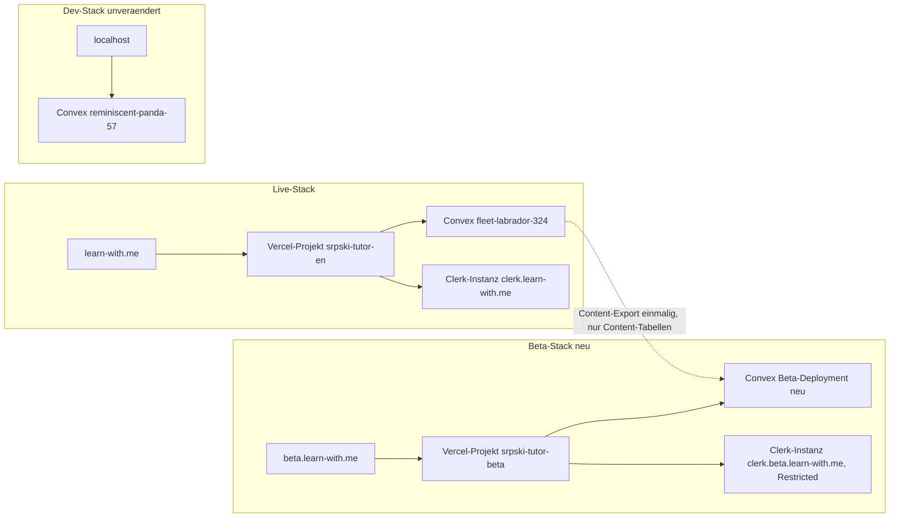

# Setup-Runbook: Geschlossene Beta-Umgebung auf beta.learn-with.me

## Zweck dieses Dokuments

Dieses Runbook beschreibt alle manuellen Dashboard-Schritte, die nötig sind,
um `beta.learn-with.me` als eigenständige, geschlossene Beta-Umgebung
aufzubauen - getrennt von Production (`learn-with.me`) und Dev
(`localhost`). Diese Schritte laufen ausschließlich über die Dashboards von
Convex, Clerk und Vercel (bzw. den DNS-Provider) und können nicht durch den
Agenten automatisiert werden, weil dafür keine API/CLI-Funktion zur
Verfügung steht, die neue Projekte/Applications anlegt.

**Was der Agent NACH Abschluss dieser Schritte übernehmen kann** (jeweils
nur nach expliziter Zustimmung, siehe [AGENTS.md](../AGENTS.md)):

- Environment-Variablen im neuen Convex-Beta-Deployment setzen (`envSet`)
- `npx convex deploy` gegen das Beta-Deployment
- Content-Export aus Production und selektiven Import in die Beta
- Smoke-Test der Beta-Umgebung

Die Code-Anpassungen (CSP, CORS, `noindex`-Flag, `AGENTS.md`-Dokumentation)
sind bereits umgesetzt (siehe Commit-History dieses Repos).

---

## Zielarchitektur



Alle drei Umgebungen nutzen dasselbe Git-Repository. Die Beta unterscheidet
sich vom Live-System nur durch Environment-Variablen (Convex-URL,
Clerk-Keys, App-URL) - kein Code-Fork.

**Wichtiger Hinweis zur Branch-Namensgebung:** Dieses Repository hat keinen
`main`-Branch; der aktuell ausgecheckte und auf `origin` gepflegte Branch
heißt `beta` und ist zugleich der Branch, von dem die **Live**-Seite
(`learn-with.me`) aktuell deployt wird. Das ist eine reine
Namens-Koinzidenz aus der Projekthistorie und hat nichts mit der neuen
Beta-**Test**-Umgebung zu tun. Verwechsle beim Einrichten des neuen
Vercel-Projekts nicht den Git-Branch `beta` mit der Beta-Umgebung
`beta.learn-with.me` - beide können denselben Branch nutzen, das ist
unkritisch, weil die Unterscheidung ausschließlich über die
Environment-Variablen pro Vercel-Projekt erfolgt.

---

## Schritt 1: Neues Convex-Projekt anlegen

1. Öffne [dashboard.convex.dev](https://dashboard.convex.dev) und melde dich
   mit dem Account an, der auch die bestehenden Projekte (Dev
   `reminiscent-panda-57`, Prod `fleet-labrador-324`) verwaltet.
2. **+ New Project** → Name z.B. `srpski-tutor-beta`.
3. Convex legt automatisch ein Dev- und ein Production-Deployment für dieses
   neue Projekt an. Für die Beta-Umgebung nutzen wir das
   **Production-Deployment** dieses neuen Projekts als Backend (nicht das
   Dev-Deployment).
4. Notiere dir:
   - Deployment-URL (`https://<name>.convex.cloud`)
   - Site-URL (`https://<name>.convex.site`)
   - **Deploy Key** für das Production-Deployment: **Settings → URL & Deploy
     Key → Generate Production Deploy Key**. Diesen Key niemals in
     Git-Dateien schreiben - nur lokal in `.env.local` oder als
     Shell-Variable verwenden.

### Environment-Variablen im neuen Convex-Deployment setzen

Setze diese unter **Settings → Environment Variables** des neuen
Production-Deployments (oder gib mir Key/Value-Paare, dann setze ich sie
per `envSet`, nachdem du grünes Licht gegeben hast):

| Variable | Wert für Beta | Quelle/Hinweis |
|---|---|---|
| `CLERK_JWT_ISSUER_DOMAIN` | Issuer-URL der neuen Beta-Clerk-Instanz | aus Schritt 2 |
| `CLERK_SECRET_KEY` | `sk_live_...` der Beta-Clerk-Instanz | aus Schritt 2 |
| `CLERK_WEBHOOK_SECRET` | Signing Secret des Beta-Webhook-Endpoints | aus Schritt 2 (Clerk Webhooks) |
| `VITE_APP_URL` | `https://beta.learn-with.me` | wird auch serverseitig in E-Mail-Links verwendet (`convex/email.ts`, `convex/waitlist.ts`, `convex/http.ts`, `convex/newsletter.ts`) |
| `RESEND_API_KEY` | eigener oder gemeinsamer Resend-Key | Entscheidung: siehe Hinweis unten |
| `RESEND_FROM_EMAIL` | z.B. `beta@mail.jacksenn.me` (empfohlen, damit Beta-Mails erkennbar sind) | |
| `RESEND_REPLY_TO_EMAIL` | wie Production oder eigene Beta-Adresse | |
| `RESEND_WEBHOOK_SECRET` | eigener Resend-Webhook-Endpoint für Beta | nur nötig, falls Newsletter/E-Mail-Events in der Beta getestet werden |
| `ADMIN_NOTIFICATION_EMAIL` | deine Admin-Adresse | |
| `GEMINI_API_KEY` | eigener oder gemeinsamer Key (AI-Buddy) | |
| `OWNER_EMAIL` | deine E-Mail (wirst automatisch Superadmin in der Beta-DB) | |
| `BOT_AUTOMATION_KEY` | neuer, zufälliger String | nur falls Automations-Tests genutzt werden |
| `ADMIN_SECRET` | neuer, zufälliger String | für Admin-API-Zugriff (`convex/authz.ts`) |
| `DODO_PAYMENTS_ENVIRONMENT` | `test_mode` | **keine echten Zahlungen in der Beta** |
| `DODO_PAYMENTS_API_KEY` | Dodo **Test**-API-Key | siehe Dodo-Hinweis unten |
| `DODO_PAYMENTS_WEBHOOK_SECRET` | Signing Secret des Dodo-Test-Webhooks | nur falls Billing-Flows in der Beta getestet werden sollen |

**Zu entscheidende Punkte (bitte im Vorfeld klären, keine Annahme meinerseits):**

- **`BETA_MODE` / `BETA_END_DATE`**: Diese beiden Variablen steuern eine
  *produktinterne* Funktion (automatische Beta-Tester-Kennzeichnung +
  einmaliger Rabatt-Code, siehe `convex/users.ts`, `convex/subscriptions.ts`)
  - unabhängig von der neuen Deployment-Umgebung. Sollen neu registrierte
    Beta-Tester auf `beta.learn-with.me` automatisch als `isBetaTester`
    markiert werden (mit Rabatt-Anspruch nach Beta-Ende)? Falls ja, hier
    ebenfalls setzen.
- **Dodo-Produkte**: Für echte Kauf-Flows in der Beta (Test-Modus) müssten
  die `DODO_PRODUCT_*`-Variablen mit Test-Produkt-IDs aus dem
  Dodo-Test-Dashboard befüllt werden. Falls Billing in der Beta nicht
  getestet werden soll, kann dieser Block vorerst leer bleiben.
- **Resend**: Gemeinsamer Key mit eigener `FROM`-Adresse (einfacher) oder
  komplett eigener Resend-Account für die Beta (saubere Trennung der
  E-Mail-Statistiken)?

### Functions deployen

Sobald die Env-Vars gesetzt sind, im Projektverzeichnis (nach deiner
expliziten Zustimmung):

```bash
CONVEX_DEPLOY_KEY=<production-deploy-key-der-beta> npx convex deploy
```

---

## Schritt 2: Clerk Beta-Instanz anlegen

1. [clerk.com/dashboard](https://clerk.com/dashboard) → **+ Create
   application** → Name z.B. `srpski-tutor-beta`.
2. Wähle die gleichen Anmeldemethoden wie in der Live-Instanz (Email,
   Google-OAuth etc. - konsistent mit bestehender UX, siehe
   `client/src/pages/auth/SignIn.tsx` / `SignUp.tsx`).
3. Wechsle direkt in den **Production**-Modus der neuen Application
   (oben rechts).

### Custom Domain einrichten

1. **Domains** → **Add domain** → `beta.learn-with.me`.
2. Clerk zeigt dir die exakten CNAME-Records (typischerweise für
   `clerk.beta.learn-with.me`, `accounts.beta.learn-with.me`,
   `clkmail.beta.learn-with.me` o.ä.). Trage diese beim DNS-Provider von
   `learn-with.me` ein.
3. Warte auf Verifizierung im Clerk-Dashboard (DNS-Propagation kann bis zu
   einer Stunde dauern).

### JWT-Template für Convex

1. **JWT Templates** → **New template** → Vorlage **Convex** wählen (Name
   bleibt `convex`, das erwartet `convex/auth.config.ts`).
2. Kopiere die **Issuer**-URL → das ist der Wert für
   `CLERK_JWT_ISSUER_DOMAIN` aus Schritt 1.

### Restricted Sign-up (geschlossene Beta)

1. **User & Authentication → Restrictions**.
2. Sign-up-Modus auf **Restricted** stellen: Nur Nutzer, die vorher
   eingeladen wurden oder auf einer Allowlist stehen, können sich
   registrieren.
3. Tester einladen: **Users → Invite** (E-Mail-Adresse eingeben, Clerk
   verschickt automatisch eine Einladung mit Registrierungslink). Das ist
   der laufende Freigabe-Prozess - kein App-Code nötig.

### Webhook für Convex einrichten

1. **Webhooks → Add Endpoint** → URL: `https://<beta-deployment>.convex.site/clerk-webhook`
   (Site-URL aus Schritt 1).
2. Events abonnieren: `user.created`, `user.deleted`, `session.created`
   (siehe `convex/http.ts` - identisch zur Production-Konfiguration).
3. Signing Secret kopieren → `CLERK_WEBHOOK_SECRET` aus Schritt 1.

### API Keys

**API Keys** → `pk_live_...` und `sk_live_...` notieren (für Schritt 1 und
Schritt 3).

---

## Schritt 3: Vercel Beta-Projekt + DNS

1. [vercel.com/dashboard](https://vercel.com/dashboard) → **Add New →
   Project** → dasselbe GitHub-Repo (`jaxn58/srpski-learn-buddy`) erneut
   importieren (Vercel erlaubt mehrere Projekte auf demselben Repo).
2. Projektname z.B. `srpski-tutor-beta`. Framework wird automatisch als Vite
   erkannt (`vercel.json` im Repo gilt für beide Projekte gleich: Build
   `pnpm build`, Output `dist/public`).
3. **Vor dem ersten Deploy prüfen**: Settings → Git → welcher Branch ist
   beim bestehenden Projekt `srpski-tutor-en` als *Production Branch*
   konfiguriert, und ist "Automatically deploy" aktiv? Das bestimmt, ob ein
   `git push` künftig automatisch Deployments auslöst. Für Konsistenz mit
   dem bisherigen (rein manuellen) Deploy-Workflow empfiehlt es sich, für
   das neue Beta-Projekt automatische Production-Deploys ebenfalls
   **auszuschalten** und stattdessen weiterhin gezielt per `vercel --prod`
   zu deployen (nur nach expliziter Zustimmung, siehe `AGENTS.md`).
4. **Settings → Domains** → `beta.learn-with.me` hinzufügen. Vercel zeigt
   einen CNAME-Zielwert (typischerweise `cname.vercel-dns.com`) - beim
   DNS-Provider eintragen.
5. **Settings → Environment Variables** (Scope: Production dieses
   Beta-Projekts):

   | Variable | Wert |
   |---|---|
   | `VITE_CONVEX_URL` | Beta-Convex-URL aus Schritt 1 |
   | `VITE_CONVEX_SITE_URL` | Beta-Convex-Site-URL aus Schritt 1 |
   | `VITE_CLERK_PUBLISHABLE_KEY` | `pk_live_...` aus Schritt 2 |
   | `CLERK_SECRET_KEY` | `sk_live_...` aus Schritt 2 (für `api/audio/generate.ts` Bearer-Auth) |
   | `VITE_APP_URL` | `https://beta.learn-with.me` |
   | `VITE_SITE_URL` | `https://beta.learn-with.me` (Prerender-Canonical) |
   | `VITE_BETA_ENV` | `on` (aktiviert `noindex, nofollow`, siehe `scripts/prerender-landing.ts`) |
   | `CONVEX_URL` | gleich wie `VITE_CONVEX_URL` (wird von `api/audio/generate.ts` als Fallback gelesen) |
   | `GOOGLE_CLOUD_SERVICE_ACCOUNT_KEY` | eigener oder gemeinsamer Service-Account-JSON (TTS) |
   | `TTS_API_SECRET` | **nicht setzen** (siehe bekannter Bug in `AGENTS.md` - wird für Audio-Upload nicht benötigt) |
   | übrige nicht-`VITE_`-Variablen aus dem bestehenden Prod-Projekt, die von `api/**` verwendet werden | 1:1 übernehmen, sofern nicht Convex-spezifisch (die o.g. Convex-Variablen gehören ins Convex-Dashboard, nicht nach Vercel) |

6. Erstes Deployment: nach deiner expliziten Zustimmung `vercel --prod`
   gegen dieses Projekt (separater Projekt-Link, z.B. via `vercel link` mit
   Auswahl des neuen Projekts in einem eigenen Terminal-Kontext, oder über
   den "Deploy"-Button im Dashboard für den initialen Build).

---

## Schritt 4: Content aus Production in die Beta kopieren

**Nur nach deiner expliziten Zustimmung**, da hierbei Production-Daten
gelesen werden:

1. Export aus Prod: `npx convex export --path beta-content-export.zip`
   (gegen `fleet-labrador-324`).
2. Selektiver Import in die Beta - **nur** Content-/Konfigurationstabellen:
   `moduleMetadata`, `unitMetadata`, `unitContent`, `unitInteractiveTests`,
   `courseVocabulary`, `platformConfig`, E-Mail-Templates, Changelog-Tabellen.
   **Keine** User-, Progress-, Subscription- oder Payment-Tabellen.
   ```bash
   npx convex import --table <tabellenname> beta-content-export.zip --url <beta-convex-url>
   ```
3. **Audio-Dateien**: Liegen im Convex File Storage von Prod;
   `storageId`-Referenzen sind nicht deployment-übergreifend gültig. Vor dem
   Import prüfen, welche der oben genannten Tabellen `storageId`-Felder für
   Audio enthalten, und entscheiden: Storage-Dateien separat
   exportieren/importieren, oder Audio in der Beta bei Bedarf neu generieren
   lassen (TTS-Funktion ist ohnehin vorhanden).

---

## Schritt 5: Smoke-Test

- [ ] Einladung via Clerk erhalten und Registrierung abschließen
- [ ] Login funktioniert, JWT wird von Convex akzeptiert (kein
      "Not authenticated"-Fehler)
- [ ] Landing-Page zeigt `noindex`-Meta-Tag (Quelltext prüfen)
- [ ] Unit öffnen, Vokabeln anzeigen
- [ ] Quiz/Übung durchführen, XP-Vergabe korrekt (5/10/20, danach 0)
- [ ] Audio-Wiedergabe funktioniert (Lautsprecher-Icon)
- [ ] Admin-Bereich mit `OWNER_EMAIL`-Account erreichbar

---

## Schritt 6: Laufender Betrieb

- **Tester einladen**: Clerk-Dashboard → Users → Invite. Kein App-Code
  nötig.
- **Updates der Beta**: normaler Zweischritt-Deploy (`npx convex deploy`,
  dann `vercel --prod`) gezielt gegen die Beta-Ziele, jeweils nach
  expliziter Zustimmung. Die Live-Seite bleibt davon unberührt.

---

## Was ich (Agent) von dir nach Abschluss der Schritte 1-3 brauche

Damit ich die verbleibenden, automatisierbaren Teile übernehmen kann:

- Convex Beta: Deployment-URL, Site-URL, Production Deploy Key
- Clerk Beta: Issuer-Domain, `pk_live_...`, `sk_live_...`, Webhook-Signing-Secret
- Vercel Beta: Projektname (für gezielte Deploys)

Bitte gib mir diese Werte ausschließlich über einen sicheren Kanal (nicht
in eine Git-getrackte Datei) - z.B. direkt im Chat als temporäre
Shell-Variablen, die ich nicht persistiere.

---

## Kosten/Nebenwirkungen

- Zweite Clerk-Production-Instanz: im Free-Tier bis 10.000 MAU kostenlos,
  Restricted-Mode-Verfügbarkeit je Plan prüfen.
- Drittes Convex-Projekt: eigenes Team-Projekt, zählt gegen
  Team-Limits/Usage.
- Es werden zu keinem Zeitpunkt Daten von Dev nach Production übertragen;
  der Content-Fluss ist ausschließlich Prod → Beta (lesend aus Prod, siehe
  `AGENTS.md`, oberste Regel).
