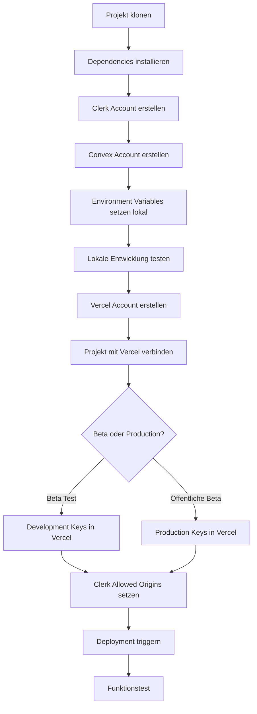
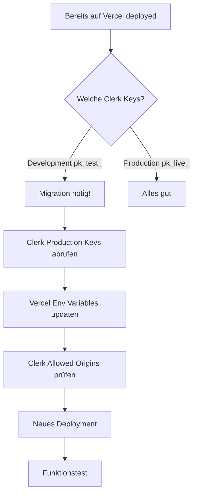

# Deployment Documentation - Übersicht

Diese Seite gibt dir einen Überblick über alle verfügbaren Deployment-Guides für die Serbian AI Tutor App.

## 📚 Verfügbare Guides

### 1. Vercel Deployment

#### [VERCEL_DEPLOYMENT_GUIDE.md](./VERCEL_DEPLOYMENT_GUIDE.md)
**Umfang**: Vollständiger Guide für das initiale Vercel-Deployment

**Inhalt**:
- Vercel-Konfiguration (`vercel.json`)
- Environment Variables Setup
- Beta-Schutz (Password Protection, Vercel Authentication)
- Automatisches Deployment via Git
- Troubleshooting

**Wann verwenden**: Beim ersten Deployment auf Vercel

---

#### [VERCEL_QUICK_START.md](./VERCEL_QUICK_START.md)
**Umfang**: Schnelleinstieg für erfahrene Entwickler

**Inhalt**:
- Kompakte Schritt-für-Schritt-Anleitung
- Minimale Konfiguration
- Schneller Start ohne Details

**Wann verwenden**: Wenn du bereits Erfahrung mit Vercel hast

---

### 2. Clerk Authentication

#### [CLERK_PRODUCTION_MIGRATION.md](./CLERK_PRODUCTION_MIGRATION.md)
**Umfang**: Migration von Clerk Development zu Production

**Inhalt**:
- Unterschied Development vs. Production
- Schritt-für-Schritt Migration
- Vercel Environment Variables Update
- Clerk Allowed Origins Konfiguration
- Convex Integration
- Ausführliches Troubleshooting

**Wann verwenden**: 
- Vor dem öffentlichen Beta-Launch
- Wenn du von Test-Keys zu Live-Keys wechselst
- Wenn du bereits auf Vercel deployed hast, aber noch Development-Keys nutzt

---

#### [CLERK_PRODUCTION_QUICK_START.md](./CLERK_PRODUCTION_QUICK_START.md)
**Umfang**: Schnellreferenz für Clerk Production Migration

**Inhalt**:
- TL;DR - Die wichtigsten Schritte
- 5-Minuten-Checkliste
- Häufige Fehler und Lösungen

**Wann verwenden**: Als Checkliste während der Migration

---

### 3. Convex Backend

#### [README.md](./README.md) (Abschnitt "Set Up Convex")
**Umfang**: Convex Setup für lokale Entwicklung und Production

**Inhalt**:
- Convex Account erstellen
- Deployment initialisieren
- Schema pushen
- Environment Variables

**Wann verwenden**: Bei der initialen Projekt-Einrichtung

---

### 4. Email-System

#### [EMAIL_AUTOMATION_IMPLEMENTATION.md](./EMAIL_AUTOMATION_IMPLEMENTATION.md)
**Umfang**: Resend Email-Integration

**Inhalt**:
- Resend Setup
- Email-Templates
- Webhook-Konfiguration

**Wann verwenden**: Wenn du Email-Benachrichtigungen aktivieren willst

---

## 🎯 Deployment-Workflow

### Für neue Projekte (von Grund auf)



**Guides in Reihenfolge**:
1. [README.md](./README.md) - Lokales Setup
2. [VERCEL_DEPLOYMENT_GUIDE.md](./VERCEL_DEPLOYMENT_GUIDE.md) - Vercel Setup
3. [CLERK_PRODUCTION_MIGRATION.md](./CLERK_PRODUCTION_MIGRATION.md) - Clerk Production (falls öffentliche Beta)

---

### Für bestehende Deployments (Migration zu Production)



**Guides in Reihenfolge**:
1. [CLERK_PRODUCTION_QUICK_START.md](./CLERK_PRODUCTION_QUICK_START.md) - Schnellübersicht
2. [CLERK_PRODUCTION_MIGRATION.md](./CLERK_PRODUCTION_MIGRATION.md) - Detaillierte Anleitung

---

## 🛠️ Helper Scripts

### Clerk Production Migration

**Windows PowerShell**:
```powershell
.\scripts\update-vercel-env-production.ps1
```

**Linux/Mac**:
```bash
chmod +x scripts/update-vercel-env-production.sh
./scripts/update-vercel-env-production.sh
```

**Was macht das Script**:
- Prüft Vercel CLI Installation
- Fragt Clerk Production Keys ab
- Setzt Environment Variables in Vercel
- Optional: Triggert neues Deployment

---

## 📋 Checklisten

### Pre-Deployment Checkliste

- [ ] Clerk Account erstellt (Development + Production)
- [ ] Convex Account erstellt
- [ ] Vercel Account erstellt
- [ ] Alle Environment Variables lokal gesetzt
- [ ] Lokale Entwicklung funktioniert
- [ ] `pnpm build` läuft ohne Fehler

### Production-Deployment Checkliste

- [ ] Clerk Production Keys abgerufen
- [ ] Vercel Environment Variables gesetzt (Production)
- [ ] Clerk Allowed Origins konfiguriert
- [ ] Convex Production Deployment erstellt
- [ ] Beta-Schutz aktiviert (falls gewünscht)
- [ ] Deployment getriggert
- [ ] Funktionstest durchgeführt
- [ ] Registrierung/Login getestet
- [ ] Browser-Konsole prüft (keine Fehler)
- [ ] Clerk Dashboard zeigt User

### Post-Deployment Checkliste

- [ ] Custom Domain konfiguriert (optional)
- [ ] Email-System aktiviert (optional)
- [ ] Monitoring eingerichtet (Vercel Analytics)
- [ ] Error Tracking aktiv
- [ ] Beta-Tester eingeladen
- [ ] Feedback-Kanal eingerichtet

---

## 🆘 Troubleshooting

### Häufige Probleme und Lösungen

| Problem | Lösung | Guide |
|---------|--------|-------|
| Build schlägt fehl | Prüfe Build-Logs, Dependencies | [VERCEL_DEPLOYMENT_GUIDE.md](./VERCEL_DEPLOYMENT_GUIDE.md#troubleshooting) |
| "Invalid publishable key" | Falscher Clerk Key oder Environment | [CLERK_PRODUCTION_MIGRATION.md](./CLERK_PRODUCTION_MIGRATION.md#troubleshooting) |
| CORS-Fehler | Allowed Origins in Clerk fehlt | [CLERK_PRODUCTION_MIGRATION.md](./CLERK_PRODUCTION_MIGRATION.md#phase-3-clerk-allowed-origins-konfigurieren) |
| Convex-Verbindung fehlgeschlagen | `VITE_CONVEX_URL` falsch oder fehlt | [VERCEL_DEPLOYMENT_GUIDE.md](./VERCEL_DEPLOYMENT_GUIDE.md#troubleshooting) |
| User nicht gefunden | Development vs. Production User-DB | [CLERK_PRODUCTION_MIGRATION.md](./CLERK_PRODUCTION_MIGRATION.md#wichtig-zu-wissen) |

---

## 📞 Support

Bei Problemen:

1. **Dokumentation prüfen**: Siehe relevanten Guide oben
2. **Troubleshooting-Sektion**: Jeder Guide hat eine Troubleshooting-Sektion
3. **Logs prüfen**:
   - Vercel: Dashboard → Deployments → Logs
   - Convex: Dashboard → Logs
   - Browser: Developer Tools → Console
4. **Community/Support**:
   - Vercel: [vercel.com/support](https://vercel.com/support)
   - Clerk: [clerk.com/support](https://clerk.com/support)
   - Convex: [convex.dev/community](https://convex.dev/community)

---

## 🔄 Updates

Diese Dokumentation wird regelmäßig aktualisiert. Letzte Änderung: 2024-12-16

**Änderungshistorie**:
- 2024-12-16: Clerk Production Migration Guide hinzugefügt
- 2024-12-16: Deployment Index erstellt
