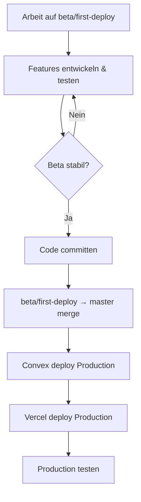

# Git Branching Strategie und Deployment-Workflow

**Dokumentation für die Git-Branch-Strategie und den Workflow von Beta zu Production**

---

## 📋 Inhaltsverzeichnis

1. [Branch-Strategie](#branch-strategie)
2. [Workflow: Beta → Production](#workflow-beta--production)
3. [Schritt-für-Schritt Anleitung](#schritt-für-schritt-anleitung)
4. [Best Practices](#best-practices)
5. [Troubleshooting](#troubleshooting)

---

## 🌳 Branch-Strategie

### Aktuelle Branch-Struktur

```
master (lokal) → origin/main_en (Remote)   ← Produktionsumgebung (immer stabil, deployed)
  ↑
  └─ beta/first-deploy     ← Beta-Testing (aktuell)
       ↑
       └─ feature/*        ← Feature-Entwicklung (optional)
```

**Wichtig:** Der lokale `master` Branch ist mit `origin/main_en` verknüpft. Der Remote-Branch heißt `main_en`, nicht `master`.

### Branch-Zwecke

- **`master` (lokal) / `main_en` (Remote)**: Production-Branch
  - Immer deploybar und stabil
  - Wird automatisch auf Vercel Production deployed
  - Enthält nur getestete und freigegebene Features
  - **Hinweis:** Lokaler Branch heißt `master`, Remote-Branch heißt `main_en`

- **`beta/first-deploy`**: Beta-Testing Branch
  - Für Beta-Tests und Experimente
  - Kann instabil sein während der Entwicklung
  - Wird nach erfolgreichem Testing nach `master` gemerged

- **`feature/*`**: Feature-Branches (optional)
  - Für neue Features oder Bugfixes
  - Werden nach `beta/first-deploy` oder direkt nach `master` gemerged

---

## 🔄 Workflow: Beta → Production

### Standard-Workflow



### Wichtige Regeln

1. **Convex ZUERST deployen** (wenn Convex-Code geändert wurde)
2. **DANN Vercel/Frontend deployen**
3. **DANN Daten-Migration** (falls nötig)

Siehe auch: [DEVELOPMENT_PRODUCTION_WORKFLOW.md](./DEVELOPMENT_PRODUCTION_WORKFLOW.md#kritische-deployment-regel)

---

## 📝 Schritt-für-Schritt Anleitung

### Schritt 1: Code committen (auf beta/first-deploy)

```powershell
# Stelle sicher, dass du auf beta/first-deploy bist
git checkout beta/first-deploy

# Prüfe Status
git status

# Füge alle Änderungen hinzu
git add .

# Committe mit aussagekräftiger Message
git commit -m "fix: Filter units to show only those with vocabulary and metadata"

# Pushe zu Remote
git push origin beta/first-deploy
```

### Schritt 2: Merge von beta/first-deploy nach main

**Option A: Merge via Git (empfohlen für kleine Änderungen)**

```powershell
# Wechsle zu master Branch
git checkout master

# Stelle sicher, dass master aktuell ist (pull von origin/main_en)
git pull

# Merge beta/first-deploy nach master
git merge beta/first-deploy

# Prüfe ob alles korrekt ist
git log --oneline -5

# Pushe master zu Remote (wird als main_en gepusht)
git push origin master:main_en
```

**Hinweis:** Da der lokale `master` mit `origin/main_en` verknüpft ist, kannst du auch einfach `git push` verwenden. Falls du explizit pushen möchtest: `git push origin master:main_en`

**Option B: Merge via Pull Request (empfohlen für größere Änderungen)**

1. Gehe zu GitHub/GitLab Repository
2. Erstelle Pull Request: `beta/first-deploy` → `master`
3. Review durchführen (falls nötig)
4. Merge Pull Request
5. Lokal aktualisieren:
   ```powershell
   git checkout master
   git pull  # Pullt automatisch von origin/main_en
   ```

### Schritt 3: Convex auf Production deployen

**WICHTIG:** Nur wenn Convex-Code geändert wurde (`convex/*.ts`)

```powershell
# Stelle sicher, dass du auf master Branch bist
git checkout master

# Stelle sicher, dass master aktuell ist
git pull  # Pullt automatisch von origin/main_en

# Deploye Convex auf Production
npx convex deploy --prod --yes
```

**Was wird deployed:**
- Alle Convex Queries, Mutations, Actions
- Schema-Änderungen
- Convex Functions

**Was wird NICHT deployed:**
- Daten (müssen separat migriert werden)
- Environment Variables (müssen in Vercel gesetzt werden)

### Schritt 4: Vercel/Frontend deployen

**Automatisch:**
- Vercel deployed automatisch nach Push zu `main`
- Prüfe Vercel Dashboard → Deployments

**Manuell (falls nötig):**
```powershell
# Stelle sicher, dass du auf master Branch bist
git checkout master

# Deploye manuell auf Vercel Production
vercel --prod --yes
```

### Schritt 5: Daten-Migration (falls nötig)

**Wann ist Migration nötig?**
- ✅ Nach Schema-Änderungen
- ✅ Nach Content-Updates (neue Units, Vocabulary)
- ✅ Nach Email-Template-Änderungen
- ✅ Nach Konfigurations-Änderungen

**Migration durchführen:**

```powershell
# Stelle sicher, dass Environment Variables gesetzt sind
# In .env.local oder .env:
# VITE_CONVEX_URL=https://your-dev-deployment.convex.cloud
# VITE_CONVEX_URL_PRODUCTION=https://your-prod-deployment.convex.cloud

# Führe Migration aus
pnpm migrate:production
```

Siehe auch: [DEVELOPMENT_PRODUCTION_WORKFLOW.md](./DEVELOPMENT_PRODUCTION_WORKFLOW.md#daten-migration)

### Schritt 6: Production testen

1. **Öffne Production-URL** (z.B. `https://your-app.vercel.app`)
2. **Teste kritische Funktionen:**
   - Login/Registrierung
   - Vocabulary-Seite (Units sollten korrekt angezeigt werden)
   - Quiz-Funktionalität
   - Progress-Tracking
3. **Prüfe Browser-Konsole** (F12 → Console)
   - Keine Fehler sollten erscheinen
4. **Prüfe Vercel Logs** (Dashboard → Deployments → Logs)
5. **Prüfe Convex Logs** (Dashboard → Logs)

---

## ✅ Best Practices

### DO's ✅

- ✅ **Immer auf beta/first-deploy entwickeln** (nicht direkt auf main)
- ✅ **Vor Merge: Code testen** in Development-Umgebung
- ✅ **Aussagekräftige Commit-Messages** verwenden
- ✅ **Convex ZUERST deployen** (wenn Convex-Code geändert wurde)
- ✅ **Nach Deployment: Production testen**
- ✅ **Nach Schema-Änderungen: Migration durchführen**
- ✅ **Nach Merge: main Branch lokal aktualisieren**

### DON'Ts ❌

- ❌ **NIEMALS direkt auf master entwickeln**
- ❌ **NIEMALS ungetesteten Code nach master mergen**
- ❌ **NIEMALS Vercel vor Convex deployen** (wenn Convex-Code geändert wurde)
- ❌ **NIEMALS Migration überspringen** bei Schema-Änderungen
- ❌ **NIEMALS Force-Push auf master** (außer in Notfällen)

---

## 🔍 Troubleshooting

### Problem: Merge-Konflikte

**Lösung:**
```powershell
# Konflikte auflösen
git merge beta/first-deploy
# Bearbeite konfliktbehaftete Dateien
git add .
git commit -m "fix: Resolve merge conflicts"
git push origin master:main_en  # Oder einfach: git push
```

### Problem: "Convex functions not found" nach Deployment

**Ursache:** Vercel wurde vor Convex deployed

**Lösung:**
1. Deploye Convex auf Production:
   ```powershell
   npx convex deploy --prod --yes
   ```
2. Warte 1-2 Minuten
3. Triggere neues Vercel Deployment:
   ```powershell
   vercel --prod --yes
   ```

Siehe auch: [DEVELOPMENT_PRODUCTION_WORKFLOW.md](./DEVELOPMENT_PRODUCTION_WORKFLOW.md#kritische-deployment-regel)

### Problem: Production zeigt alte Daten

**Ursache:** Migration nicht durchgeführt

**Lösung:**
```powershell
# Führe Migration aus
pnpm migrate:production
```

### Problem: Falscher Branch deployed

**Prüfe:**
```powershell
# Welcher Branch ist aktuell?
git branch

# Welcher Branch ist auf Remote?
git branch -r

# Welcher Branch ist in Vercel konfiguriert?
# Prüfe Vercel Dashboard → Settings → Git
```

**Lösung:**
- Stelle sicher, dass Vercel auf `main_en` Branch deployed (nicht `master`!)
- Falls nicht: Ändere in Vercel Dashboard → Settings → Git → Production Branch: `main_en`

### Problem: "Working tree is dirty"

**Lösung:**
```powershell
# Prüfe Status
git status

# Entweder: Committe Änderungen
git add .
git commit -m "..."

# Oder: Stashe Änderungen
git stash

# Oder: Verwerfe Änderungen (VORSICHT!)
git checkout .
```

---

## 📋 Checkliste: Beta → Production Deployment

### Vor dem Merge

- [ ] Alle Features auf `beta/first-deploy` getestet
- [ ] Code committed und gepusht
- [ ] Keine Merge-Konflikte erwartet
- [ ] Backup erstellt (optional, aber empfohlen)

### Während des Merges

- [ ] Zu `master` Branch gewechselt
- [ ] `master` Branch aktualisiert (`git pull`)
- [ ] Merge durchgeführt
- [ ] Merge-Konflikte aufgelöst (falls vorhanden)
- [ ] `master` Branch gepusht

### Nach dem Merge

- [ ] Convex auf Production deployed (falls Convex-Code geändert)
- [ ] Vercel Deployment erfolgreich
- [ ] Daten-Migration durchgeführt (falls nötig)
- [ ] Production-App getestet
- [ ] Browser-Konsole geprüft (keine Fehler)
- [ ] Kritische Funktionen getestet

---

## 🔗 Verwandte Dokumentation

- [DEVELOPMENT_PRODUCTION_WORKFLOW.md](./DEVELOPMENT_PRODUCTION_WORKFLOW.md) - Detaillierter Workflow für Development vs. Production
- [VERCEL_DEPLOYMENT_GUIDE.md](./Deploy/VERCEL_DEPLOYMENT_GUIDE.md) - Vercel Deployment Guide
- [CLERK_PRODUCTION_MIGRATION.md](./CLERK_PRODUCTION_MIGRATION.md) - Clerk Production Migration

---

## 📝 Quick Reference

### Häufige Befehle

```powershell
# Branch wechseln
git checkout master
git checkout beta/first-deploy

# Status prüfen
git status
git log --oneline -5

# Merge durchführen
git checkout master
git merge beta/first-deploy
git push origin master:main_en  # Oder einfach: git push

# Convex deployen
npx convex deploy --prod --yes

# Vercel deployen
vercel --prod --yes

# Migration durchführen
pnpm migrate:production
```

---

**Letzte Aktualisierung:** Dezember 2025

