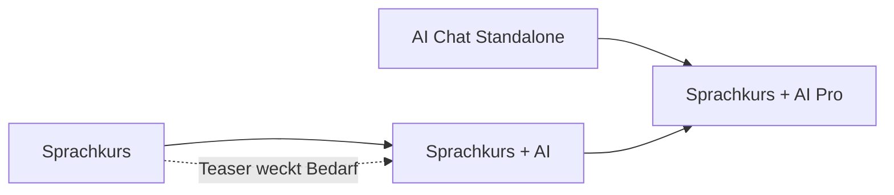

# Tarife und Features

**Teil von:** Tarif- und Token-Umbau (siehe `00_KONZEPT_UEBERSICHT.md`)

---

## 1. Abrechnungsmodell: 2-Achsen-Modell (Empfehlung)

Der Kern der Empfehlung: Das **Paket** (Welche Features?) wird zur zweiten Dimension neben der bestehenden **Laufzeit** (Wie lange?). Beide Dimensionen sind unabhängig wählbar.

```
                 Laufzeit (bestehend)
                 3 Mon. | 6 Mon. | 12 Mon.
   Paket
   ────────────────────────────────────────
   Sprachkurs            ·       ·       ·
   AI Chat Standalone    ·       ·       ·
   Sprachkurs + AI       ·       ·       ·
   Sprachkurs + AI Pro   ·       ·       ·
```

> **Hinweis (Phase 4):** Die 9-Monats-Variante wurde entfernt. Es gibt nur noch **drei Laufzeiten: 3 / 6 / 12 Monate** (siehe `00_KONZEPT_UEBERSICHT.md` §5.4 und `02_TOKEN_SYSTEM.md` §9).

### Warum dieses Modell?

- **Minimaler Bruch mit der Produktion.** Die bestehende Laufzeit-/Dodo-/Webhook-Logik in `convex/subscriptions.ts` bleibt strukturell erhalten. Es kommt im Wesentlichen ein Feld (`featureTier`) plus Energy-Felder hinzu.
- **Zero-Migration.** Bestandsabos ohne `featureTier` werden serverseitig als `"course_ai_pro"` interpretiert → kein Datenmigrations-Schritt, kein Zugriffsverlust.
- **Klarer Upgrade-Pfad.** Innerhalb derselben Laufzeit zwischen Paketen upgraden (Preisdifferenz als Top-up, wie heute bei Laufzeit-Upgrades).

### Alternative (nicht empfohlen)

Klassisches wiederkehrendes Monats-/Jahres-Abo pro Paket. Vorteil: marktüblicher; Nachteil: größerer Umbau, Bruch mit aktuellem Laufzeitmodell und mit den bereits kommunizierten Beta-Konditionen. Für später dokumentiert, aktuell nicht verfolgt.

## 2. Die vier Pakete im Detail

### 2.1 Sprachkurs (EN: „Course")

- **Enthält:** Alle Units, Vokabelsystem, interaktive Übungen, XP/Streak/Leaderboard, Fortschritt, Audio (TTS).
- **Enthält NICHT:** vollwertigen AI-Buddy, Chat-Anhänge, Wissensablage, Energy-Guthaben/-Nachkauf, Community.
- **Besonderheit – Teaser:** 1–2 AI-Fragen / 24 h. Der Teaser zeigt bewusst den **Buddy aus Sprachkurs + AI** (kontextverknüpfter Basis-Buddy) – als Vorschau und Upsell-Anker Richtung Sprachkurs + AI.
- **Zielgruppe:** Preisbewusste Lerner, Einsteiger.

### 2.2 AI Chat Standalone

- **Enthält:** Buddy-Chat, **Chat-Anhänge** (Fotos & Dateien direkt in einer Nachricht, inkl. multimodale Analyse), **Wissensablage** (persistente Dokumenten-Bibliothek in der Wissensbasis / Meine Bibliothek), Energy-Nachkauf.
- **Enthält NICHT:** Lerninhalte/Units, Context-Linking (Entscheidung: entfernt, da keine Units vorhanden), Community.
- **Zielgruppe:** Expats, Einwanderer, Profis (Büro / öffentliche Einrichtungen), die einen Sprach-/Alltagshelfer brauchen – ohne Kurs.

### 2.3 Sprachkurs + AI (EN: „Course + AI")

- **Enthält:** Alle Lerninhalte (wie Sprachkurs) **+ Basis-Buddy** (`AI Buddy Chat (Basis)`) **mit Context-Linking** (Buddy kennt die aktuelle Unit/den Lernkontext) **+ Chat-Anhänge** (Fotos & Dateien im Chat, inkl. Vision-Aufschlag in der Energy-Tabelle) **+ Energy-Nachkauf**.
- **Enthält NICHT:** Wissensablage (Wissensbasis in Meine Bibliothek), Community.
- **Speicher:** 100 MB nur für Chat-Anhänge (kein Knowledge-Rack-Speicher).
- **Energy:** **250 Energy/Monat** (Juni 2026 von 120 angehoben – UX-Korrektur, 120 wirkte als Demo-Quota) **mit** Nachkauf-Option (Top-up). Reicht für aktive Lerner mit ~3–4 Lernfragen pro Tag. Top-ups erlauben Spitzennutzung ohne Sperrung.
- **Zielgruppe:** Lerner mit AI-Support.

### 2.4 Sprachkurs + AI Pro

- **Enthält:** Alles aus Sprachkurs + AI **+ Wissensablage** (wie Standalone) **+** größeres Energy-Kontingent **+ Community/Lerngruppen** (Neu-Feature).
- **Energy:** größtes Monatskontingent (Vorschlag: 750 Energy) + Nachkauf.
- **Zielgruppe:** Power-User, Experten, Professionals.

## 3. Feature-zu-Code-Mapping (Was existiert, was ist neu?)

| Feature (Matrix) | Code-Entsprechung | Status |
|---|---|---|
| Feste Lerninhalte | Units/Vokabeln/Exercises, `convex/subscriptions.ts` `getAccessibleUnits`, `convex/units.ts` | Vorhanden |
| AI Buddy Chat (Basis) | `convex/chat.ts` `streamChatMessage`, `POST /chat/stream` | Vorhanden |
| Context-Linking | `convex/chat.ts` `buildUnitContextBlock`, `unitContext` auf Messages | Vorhanden |
| Chat-Anhänge (Fotos & Dateien im Chat) | `convex/chat.ts` (Attachment-Upload), `convex/documents.ts` (`uploadSource: "chat_attachment"`), `chatMessages.attachmentStorageId` | Vorhanden; Gate: `features.chatAttachments` |
| Wissensablage (Wissensbasis) | `convex/documents.ts` (`uploadSource: "knowledge_rack"`), `userDocuments`/`userDocumentChunks`, `client/.../KnowledgeBaseExplorer.tsx` | Vorhanden; Gate: `features.knowledgeRack` |
| Speicher-Quota pro User | `convex/storageQuota.ts` (`resolveStorageQuotaBytes`) – course_ai: 100 MB (nur Chat-Anhänge), standalone: 500 MB, course_ai_pro: 1 GB, beta: 0 | Vorhanden |
| Energy-Nachkauf möglich | `convex/subscriptions.ts` Top-up-Packs, Dodo-Produkte | Vorhanden |
| Community/Lerngruppen | – | **Neu zu bauen** (eigener Track) |
| Teaser 1–2/24h | `convex/chat.ts` Teaser-Logik für `course`-Tier | Vorhanden |

> **Begriffs-Abgrenzung (Juni 2026):** „Foto-Scan" ist **kein separates Feature-Flag** mehr. Bilder und Dateien werden als **Chat-Anhang** hochgeladen; multimodale Verarbeitung (Gemini Vision) löst den Energy-Aufschlag „Vision" in der Verbrauchstabelle aus (siehe `02_TOKEN_SYSTEM.md` §2.1). Die **Wissensablage** (Tarif-Feature) entspricht der **Wissensbasis** in **Meine Bibliothek** – getrennt von einmaligen Chat-Anhängen.

## 4. Feature-Gating (Technik-Konzept)

Angelehnt an das bereits im `chat`-Branch skizzierte Muster (`docs/FEATURE_PACKAGES_IMPLEMENTATION_PLAN.md`), aber von 3 auf **4 Tiers** erweitert.

### 4.1 Neues Feld auf `userSubscriptions`

```typescript
// convex/schema/core.ts – userSubscriptions
featureTier: v.optional(v.union(
  v.literal("course"),         // Sprachkurs
  v.literal("standalone"),     // AI Chat Standalone
  v.literal("course_ai"),      // Sprachkurs + AI
  v.literal("course_ai_pro")   // Sprachkurs + AI Pro
)),
```

`v.optional` ist bewusst gewählt: Bestandsabos ohne Feld → Default `"course_ai_pro"` (Zero-Migration).

### 4.2 Zentrale Zugriffs-Auflösung

Eine einzige Query (`getFeatureAccess`) liefert die abgeleiteten Flags – Single Source of Truth für Frontend (UI-Gating) und Backend (Durchsetzung):

```typescript
// abgeleitet aus featureTier (convex/featureAccess.ts → featuresForTier)
{
  learning:       tier === "course"     || tier === "course_ai" || tier === "course_ai_pro",
  buddyChat:      tier === "standalone" || tier === "course_ai" || tier === "course_ai_pro",
  contextLinking: tier === "course_ai"  || tier === "course_ai_pro",                          // NICHT bei standalone
  chatAttachments: tier === "standalone" || tier === "course_ai" || tier === "course_ai_pro", // Fotos/Dateien im Chat (NICHT course)
  knowledgeRack:  tier === "standalone" || tier === "course_ai_pro",                          // Wissensbasis in Meine Bibliothek (NICHT course_ai)
  community:      tier === "course_ai_pro",
  energyTopUp:    tier === "standalone" || tier === "course_ai" || tier === "course_ai_pro",  // course: Teaser only
  teaser:         tier === "course",
  // Admin/Superadmin: alles true (siehe Grandfathering)
  // Beta-Profil (course_ai lite): course_ai-Features, aber chatAttachments + knowledgeRack + energyTopUp = false
}
```

### 4.3 Durchsetzung (Defense-in-Depth)

- **Frontend:** Navigation, Routen und Buttons werden anhand der Flags ein-/ausgeblendet (z. B. kein Floating-Buddy-Button im Sprachkurs; kein „Units"-Tab im AI Chat Standalone).
- **Backend:** Dieselben Flags werden in Chat-Mutations/Actions (`convex/chat.ts`), Upload-Funktionen (`convex/documents.ts` mit `uploadSource`) und Speicher-Quotas (`convex/storageQuota.ts`) geprüft, damit API-Aufrufe nicht das Client-Gating umgehen.

### 4.4 Teaser-Logik (Sprachkurs)

- Separater Tageszähler (z. B. 1–2 Fragen / 24 h), unabhängig vom Energy-Guthaben.
- Antwortverhalten = Buddy aus Sprachkurs + AI (mit Context-Linking zur aktuellen Unit), damit die Vorschau exakt das nächsthöhere Paket repräsentiert.
- Bei aufgebrauchtem Teaser: freundlicher Upsell-Hinweis Richtung Sprachkurs + AI (kein blockierender Fehler).

## 5. Upgrade-Pfade



- **Sprachkurs → Sprachkurs + AI:** natürlicher Upgrade, vom Teaser getrieben.
- **Sprachkurs + AI → Sprachkurs + AI Pro:** für **Wissensablage** (persistente Dokumenten-Bibliothek), Community + größeres Energy-Kontingent. Chat-Anhänge sind in Sprachkurs + AI bereits enthalten – der Pro-Upsell betrifft primär die Wissensablage, nicht erneut den Chat-Upload.
- **AI Chat Standalone → Sprachkurs + AI Pro:** wenn zusätzlich Lerninhalte gewünscht sind.

Upgrades innerhalb derselben Laufzeit: Preisdifferenz als Dodo-Top-up (analog zum bestehenden Laufzeit-Upgrade in `convex/subscriptions.ts`).
