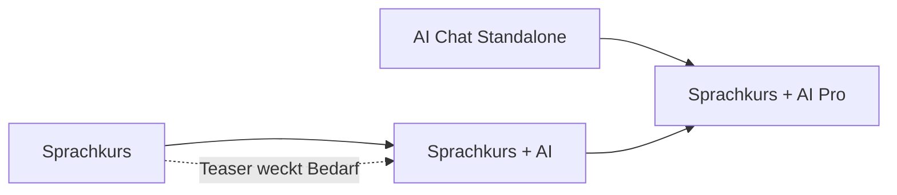

# Tarife und Features

**Teil von:** Tarif- und Token-Umbau (siehe `00_KONZEPT_UEBERSICHT.md`)

---

## 1. Abrechnungsmodell: 2-Achsen-Modell (Empfehlung)

Der Kern der Empfehlung: Das **Paket** (Welche Features?) wird zur zweiten Dimension neben der bestehenden **Laufzeit** (Wie lange?). Beide Dimensionen sind unabhängig wählbar.

```
                 Laufzeit (bestehend)
                 3 Mon. | 6 Mon. | 9 Mon. | 12 Mon.
   Paket
   ──────────────────────────────────────────────────
   Sprachkurs            ·       ·       ·       ·
   AI Chat Standalone    ·       ·       ·       ·
   Sprachkurs + AI       ·       ·       ·       ·
   Sprachkurs + AI Pro   ·       ·       ·       ·
```

### Warum dieses Modell?

- **Minimaler Bruch mit der Produktion.** Die bestehende Laufzeit-/Dodo-/Webhook-Logik in `convex/subscriptions.ts` bleibt strukturell erhalten. Es kommt im Wesentlichen ein Feld (`featureTier`) plus Energy-Felder hinzu.
- **Zero-Migration.** Bestandsabos ohne `featureTier` werden serverseitig als `"course_ai_pro"` interpretiert → kein Datenmigrations-Schritt, kein Zugriffsverlust.
- **Klarer Upgrade-Pfad.** Innerhalb derselben Laufzeit zwischen Paketen upgraden (Preisdifferenz als Top-up, wie heute bei Laufzeit-Upgrades).

### Alternative (nicht empfohlen)

Klassisches wiederkehrendes Monats-/Jahres-Abo pro Paket. Vorteil: marktüblicher; Nachteil: größerer Umbau, Bruch mit aktuellem Laufzeitmodell und mit den bereits kommunizierten Beta-Konditionen. Für später dokumentiert, aktuell nicht verfolgt.

## 2. Die vier Pakete im Detail

### 2.1 Sprachkurs (EN: „Course")

- **Enthält:** Alle Units, Vokabelsystem, interaktive Übungen, XP/Streak/Leaderboard, Fortschritt, Audio (TTS).
- **Enthält NICHT:** vollwertigen AI-Buddy, Dokumenten-Upload, Knowledge Rack, Foto-Scan, Energy-Guthaben/-Nachkauf, Community.
- **Besonderheit – Teaser:** 1–2 AI-Fragen / 24 h. Der Teaser zeigt bewusst den **Buddy aus Sprachkurs + AI** (kontextverknüpfter Basis-Buddy) – als Vorschau und Upsell-Anker Richtung Sprachkurs + AI.
- **Zielgruppe:** Preisbewusste Lerner, Einsteiger.

### 2.2 AI Chat Standalone

- **Enthält:** Buddy-Chat, Dokumenten-Upload & Analyse, Knowledge Rack (persönliche PDF-Bibliothek), Foto-Scan, Energy-Nachkauf.
- **Enthält NICHT:** Lerninhalte/Units, Context-Linking (Entscheidung: entfernt, da keine Units vorhanden), Community.
- **Zielgruppe:** Expats, Einwanderer, Profis (Büro / öffentliche Einrichtungen), die einen Sprach-/Alltagshelfer brauchen – ohne Kurs.

### 2.3 Sprachkurs + AI (EN: „Course + AI")

- **Enthält:** Alle Lerninhalte (wie Sprachkurs) **+ Basis-Buddy** (`AI Buddy Chat (Basis)`) **mit Context-Linking** (Buddy kennt die aktuelle Unit/den Lernkontext) **+ Energy-Nachkauf**.
- **Enthält NICHT:** Dokumenten-Upload, Knowledge Rack, Foto-Scan, Community.
- **Energy:** **250 Energy/Monat** (Juni 2026 von 120 angehoben – UX-Korrektur, 120 wirkte als Demo-Quota) **mit** Nachkauf-Option (Top-up). Reicht für aktive Lerner mit ~3–4 Lernfragen pro Tag. Top-ups erlauben Spitzennutzung ohne Sperrung.
- **Zielgruppe:** Lerner mit AI-Support.

### 2.4 Sprachkurs + AI Pro

- **Enthält:** Alles aus Sprachkurs + AI **+** die erweiterten Buddy-Funktionen aus Standalone (Dokumenten-Upload, Knowledge Rack, Foto-Scan) **+** größeres Energy-Kontingent **+ Community/Lerngruppen** (Neu-Feature).
- **Energy:** größtes Monatskontingent (Vorschlag: 750 Energy) + Nachkauf.
- **Zielgruppe:** Power-User, Experten, Professionals.

## 3. Feature-zu-Code-Mapping (Was existiert, was ist neu?)

| Feature (Matrix) | Code-Entsprechung | Status |
|---|---|---|
| Feste Lerninhalte | Units/Vokabeln/Exercises, `convex/subscriptions.ts` `getAccessibleUnits`, `convex/units.ts` | Vorhanden (alle Branches) |
| AI Buddy Chat (Basis) | `convex/chat.ts` `streamChatMessage`, `POST /chat/stream` | Vorhanden (feature + chat) |
| Context-Linking | `convex/chat.ts` `buildUnitContextBlock`, `unitContext` auf Messages | Vorhanden (feature + chat) |
| Dokumenten-Upload & Analyse | `client/.../ChatDocumentUpload.tsx`, `convex/documentsNode.ts`, `userDocuments`/`userDocumentChunks` | **Nur chat-Branch**; Ingestion teils unvollständig |
| Knowledge Rack (PDF-Bibliothek) | `convex/knowledge.ts`, `convex/ai/ingestKnowledge.ts`, `client/.../KnowledgeAdmin.tsx` | **Nur chat-Branch** |
| Foto-Scan | Bild-Upload + multimodal (Gemini Vision) im Chat | Vorhanden (feature + chat) |
| Energy-Nachkauf möglich | – | **Neu zu bauen** (siehe `02_TOKEN_SYSTEM.md`) |
| Community/Lerngruppen | – | **Neu zu bauen** (eigener Track, keine Vorlage in den Branches) |
| Teaser 1–2/24h | – (Rate-Limits existieren, aber kein Teaser-Zähler dieser Art) | **Neu zu bauen** (kleiner Tageszähler) |

## 4. Feature-Gating (Technik-Konzept)

Angelehnt an das bereits im `chat`-Branch skizzierte Muster (`docs/FEATURE_PACKAGES_IMPLEMENTATION_PLAN.md`), aber von 3 auf **4 Tiers** erweitert.

### 4.1 Neues Feld auf `userSubscriptions`

```typescript
// convex/schema/core.ts – userSubscriptions
featureTier: v.optional(v.union(
  v.literal("course"),         // Sprachkurs
  v.literal("standalone"),     // AI Chat Standalone
  v.literal("course_ai"),      // Sprachkurs + AI
  v.literal("course_ai_pro")   // Sprachkurs + AI Pro
)),
```

`v.optional` ist bewusst gewählt: Bestandsabos ohne Feld → Default `"course_ai_pro"` (Zero-Migration).

### 4.2 Zentrale Zugriffs-Auflösung

Eine einzige Query (`getFeatureAccess`) liefert die abgeleiteten Flags – Single Source of Truth für Frontend (UI-Gating) und Backend (Durchsetzung):

```typescript
// abgeleitet aus featureTier
{
  learning:       tier === "course"     || tier === "course_ai" || tier === "course_ai_pro",
  buddyChat:      tier === "standalone" || tier === "course_ai" || tier === "course_ai_pro",
  contextLinking: tier === "course_ai"  || tier === "course_ai_pro",                          // NICHT bei standalone
  documents:      tier === "standalone" || tier === "course_ai_pro",                          // Upload + Knowledge Rack + Foto-Scan
  community:      tier === "course_ai_pro",
  energyTopUp:    tier === "standalone" || tier === "course_ai" || tier === "course_ai_pro",  // course_ai NEU: Top-up moeglich
  // Admin/Superadmin und Beta-Tester: alles true (siehe Grandfathering)
}
```

### 4.3 Durchsetzung (Defense-in-Depth)

- **Frontend:** Navigation, Routen und Buttons werden anhand der Flags ein-/ausgeblendet (z. B. kein Floating-Buddy-Button im Sprachkurs; kein „Units"-Tab im AI Chat Standalone).
- **Backend:** Dieselben Flags werden in den Chat-Mutations/Actions (`convex/chat.ts`) und bei Upload/Knowledge-Funktionen geprüft, damit API-Aufrufe nicht das Client-Gating umgehen.

### 4.4 Teaser-Logik (Sprachkurs)

- Separater Tageszähler (z. B. 1–2 Fragen / 24 h), unabhängig vom Energy-Guthaben.
- Antwortverhalten = Buddy aus Sprachkurs + AI (mit Context-Linking zur aktuellen Unit), damit die Vorschau exakt das nächsthöhere Paket repräsentiert.
- Bei aufgebrauchtem Teaser: freundlicher Upsell-Hinweis Richtung Sprachkurs + AI (kein blockierender Fehler).

## 5. Upgrade-Pfade



- **Sprachkurs → Sprachkurs + AI:** natürlicher Upgrade, vom Teaser getrieben.
- **Sprachkurs + AI → Sprachkurs + AI Pro:** für erweiterte Buddy-Funktionen (Dokumente, Knowledge Rack, Foto-Scan) + Community + größeres Energy-Kontingent.
- **AI Chat Standalone → Sprachkurs + AI Pro:** wenn zusätzlich Lerninhalte gewünscht sind.

Upgrades innerhalb derselben Laufzeit: Preisdifferenz als Dodo-Top-up (analog zum bestehenden Laufzeit-Upgrade in `convex/subscriptions.ts`).
