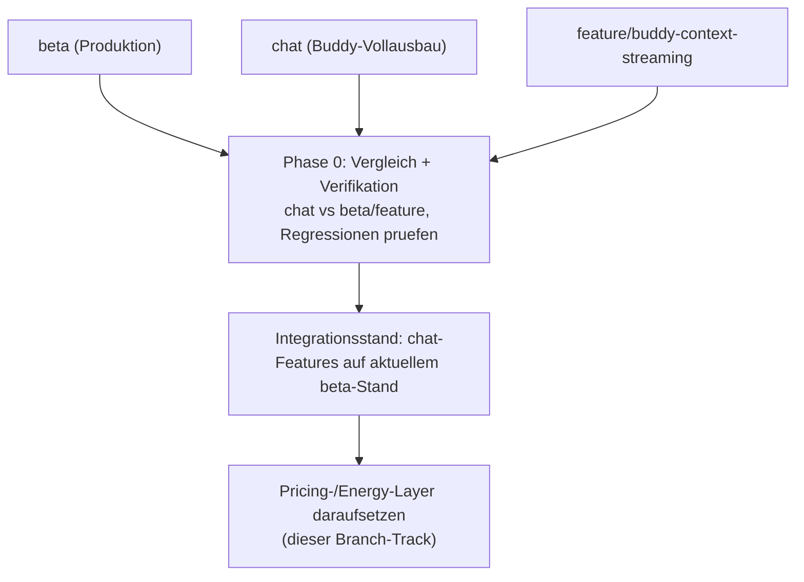
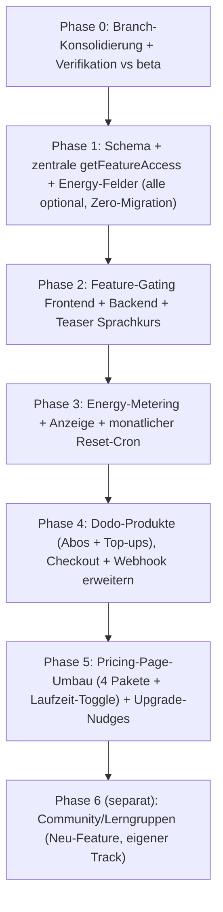

# Branch-Konsolidierung und Roadmap

**Teil von:** Tarif- und Token-Umbau (siehe `00_KONZEPT_UEBERSICHT.md`)

---

## 1. Ausgangslage der Branches

- `beta` – aktuell in **Produktion** (Beta-Test läuft).
- `feature/buddy-context-streaming` – moderater Chat-Ausbau: Buddy-Modal mit Unit-Kontext, Streaming, Datei-Anhänge, Compact/Detailed-Modus.
- `chat` – **divergierender Vollausbau** (kein Nachfolger von `feature`): komplettes RAG-System, Knowledge-Admin, Dokumenten-Upload-Pipeline, Wissensartikel, dynamische Vorschläge.
- `feature/tariff-token-restructure` – **dieser Branch** (von `feature/buddy-context-streaming` abgezweigt), enthält aktuell die Restructure-Konzeptdokumente.

Wichtig: Pricing/Subscription/Schema (`convex/subscriptions.ts`, `convex/schema/core.ts`) sind in **allen drei** Code-Branches identisch. Der Tarif-Umbau kollidiert also nicht mit den Chat-Diffs.

## 2. Branch-Empfehlung: `chat` als technische Basis

Die Matrix verlangt für **AI Chat Standalone** und **Sprachkurs + AI Pro** Funktionen, die **nur im `chat`-Branch** existieren:

- `client/src/components/ChatDocumentUpload.tsx` (Dokumenten-Upload-UI)
- `client/src/pages/KnowledgeAdmin.tsx` (Knowledge-Verwaltung)
- `convex/ai/ingestKnowledge.ts` (Ingestion)
- `convex/documentsNode.ts` (Node-seitige Dokumentenverarbeitung)
- `convex/knowledge.ts` (Knowledge-Funktionen)

In `feature/buddy-context-streaming` fehlen diese. Daher: **`chat` ist die funktionale Grundlage** für Chat-Anhänge und Wissensablage (getrennte Gates seit Juni 2026, siehe `01_TARIFE_UND_FEATURES.md`).

### Konsequenz / Vorsicht

`chat` ist von `beta` divergiert und **kein** Nachfolger von `feature`. Vor dem Aufsetzen des Pricing-Layers ist eine **Konsolidierung** nötig, damit der `chat`-Stand nicht versehentlich Produktions-Fixes aus `beta`/`feature` verliert.

## 3. Konsolidierungs-Schritte (Phase 0)

Konkret:
1. **Diff-Audit** `beta` ↔ `chat` und `feature` ↔ `chat`: welche Produktions-Fixes/Inhalte sind nur in `beta`/`feature` und müssen erhalten bleiben?
2. **Integrationsentscheidung:** entweder `chat` auf aktuellen `beta`-Stand rebasen/mergen, oder die fehlenden `chat`-Dateien gezielt in einen Integrationsbranch übernehmen.
3. **Verifikation** gegen Produktion: keine Regression bei Units, Vokabeln, Subscriptions, Auth, Webhooks.
4. Erst danach: Pricing-/Energy-Layer (Phasen 1–5) aufsetzen.

> Diese Entscheidung (Merge-Strategie für `chat`) ist vor Phase 0 final zu bestätigen.

## 4. Implementierungs-Roadmap (nach Doku-Freigabe)

### Phasen-Details

- **Phase 0 – Konsolidierung:** siehe oben. Ergebnis: stabiler Integrationsstand mit Buddy-Vollausbau auf aktuellem Produktionsfundament. *Admin:* Knowledge-/Dokumenten-Admin (`KnowledgeAdmin.tsx`, Ingestion-Pipeline) aus `chat` mit überführen (siehe `06_ADMIN_BEREICH.md`).
- **Phase 1 – Schema & zentrale Query:** `featureTier` (4 Tiers) + Energy-Felder auf `userSubscriptions`, `energyPurchases` (+ optional `energyLedger`). Zentrale `getFeatureAccess`-Query (+ interne Variante). Alles `v.optional` → Zero-Migration, Bestand = `"course_ai_pro"` + unbegrenzt. **Risiko: praktisch null.** *Admin:* Read-Sicht auf `featureTier` + Energy-Felder in `AdminUserDetail.tsx`.
- **Phase 2 – Gating:** Client-Hook + Routen/Navigations-Gating; Backend-Durchsetzung in `convex/chat.ts` (Tools nach Tier gaten); Teaser-Tageszähler für Sprachkurs (zeigt Buddy aus Sprachkurs + AI). *Admin:* Tier-Override/Grant-Mutation (Gating-konform, `superadmin`), Audit via `subscriptionHistory`.
- **Phase 3 – Energy-System:** Verbrauch je Aktionstyp verbuchen (Mutation, gemäß Verbrauchstabelle), Anzeige „X Energy übrig" + Energy-Kosten je Aktion, Low-Quota-Hinweis, monatlicher Reset-Cron in `convex/crons.ts`. *Admin:* Energy-Grant/Adjust/Reset + Verbrauchshistorie (`energyLedger` `admin_adjust`) + dynamische Energy-Config (Verbrauchstabelle/Kontingente/Modell/Budget).
- **Phase 4 – Billing:** Dodo-Produkte anlegen (Abos je Paket×Laufzeit×Modus + Energy-Top-ups), Checkout-Metadaten um `featureTier`/Energy erweitern, Webhook-Verarbeitung erweitern (Idempotenz via `dodoWebhookEvents`). *Admin:* Produkt-Mapping-Sicht (Produkt-ID ↔ Paket/Laufzeit/Modus/Top-up), Anlage via Dodo-MCP.
- **Phase 5 – Pricing-Page & UX:** `Home.tsx` / `MySubscription.tsx` auf 4 Pakete + Laufzeit-Toggle umbauen, Upgrade-Nudges/Teaser-CTAs. *Admin:* Analytics-Erweiterung (Abos je `featureTier`, Umsatz je Paket + Top-up-Umsatz, Energy-Verbrauch/KI-Kosten, Conversion).
- **Phase 6 – Community/Lerngruppen:** eigenständiges, größeres Feature ohne Vorlage → separater Track, nach dem Pricing-Umbau.

## 5. Migrations-/Rollout-Sicherheit

- Alle neuen Schema-Felder sind optional → **keine Datenmigration**, kein Zugriffsverlust für Bestands-/Beta-User (Default `"course_ai_pro"` + unbegrenzte Energy).
- Phasen 1–3 sind ohne User-Impact deploybar (alle bestehenden User bleiben „course_ai_pro"/unbegrenzt).
- Phasen 4–5 „schalten" die neuen Pakete erst für **neue** Käufe scharf.
- Strikte Einhaltung der Deploy-Regeln (AGENTS.md): **kein** Deploy auf Produktion ohne explizite Freigabe; Convex-Functions zuerst, dann Frontend.

## 6. Risiken

| Risiko | Wahrsch. | Impact | Gegenmaßnahme |
|---|---|---|---|
| `chat`-Konsolidierung verliert Produktions-Fixes | Mittel | Hoch | Diff-Audit + Verifikation in Phase 0 vor Layer |
| Bestandskunden verlieren Zugriff | Sehr gering | Kritisch | `v.optional` + Default `"course_ai_pro"` + unbegrenzte Energy |
| Viele Dodo-Produkte (bis 32 + Top-ups) | Mittel | Mittel | Ratenzahlung nur ab Sprachkurs + AI; Sprachkurs prepaid-only |
| KI-Kostenüberlauf durch Heavy-User | Gering | Mittel | Energy-Kontingent + Verbrauchs-Cap (Upload) + globales Tagesbudget |
| `userDocuments`-Ingestion unvollständig | Mittel | Mittel | In Phase 0/2 prüfen und vervollständigen (Wissensablage) |
| Neue Tabellen nicht in User-Löschung berücksichtigt | Gering | Mittel | `energyPurchases`/`energyLedger` in `_deleteUserCascade` aufnehmen (siehe `06`) |
| Entscheidungs-Paralyse (4 Pakete) | Mittel | Mittel | Sprachkurs + AI Pro prominent; klare Vergleichstabelle; Anker-Preis |

## 7. Nächste Schritte

1. Konzept-Dokumente (`00`–`06`) freigeben.
2. Offene Punkte aus `00_KONZEPT_UEBERSICHT.md` Abschnitt 5 final entscheiden (Preise, Energy-Mengen + Verbrauchstabelle, Laufzeit-Matrix, Grandfathering, Buddy-Name).
3. Merge-Strategie für `chat` festlegen (Phase 0).
4. Implementierung phasenweise starten.
