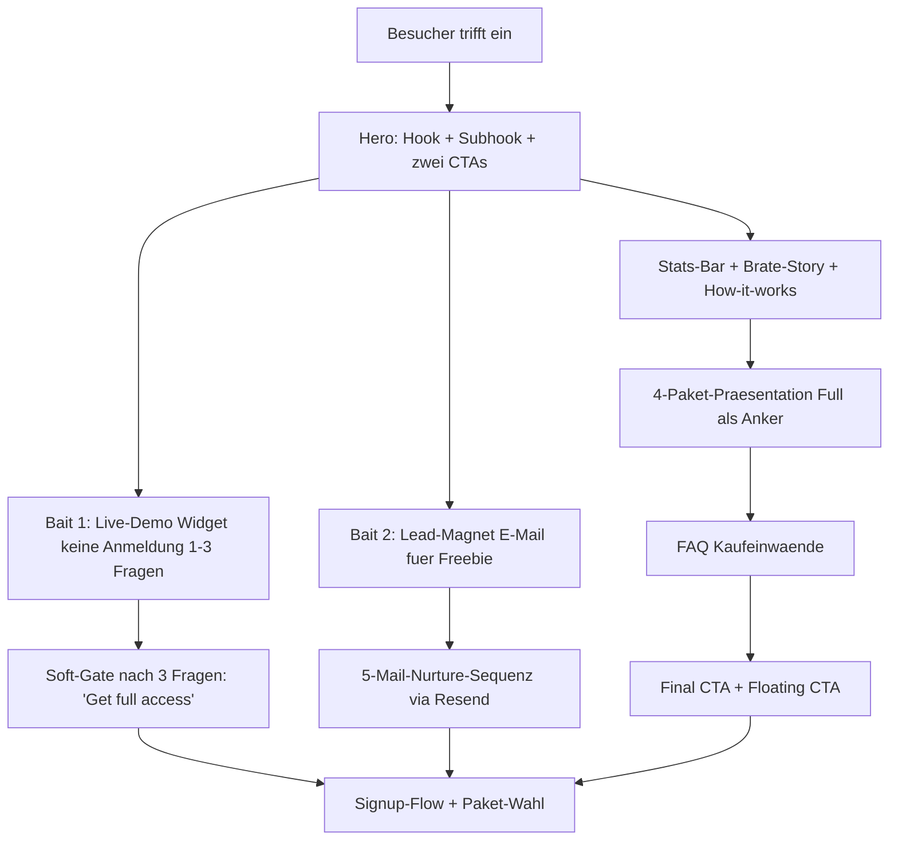

# Landing-Page-Konzept – Neues 4-Paket-System

**Teil von:** Tarif- und Token-Umbau (siehe `00_KONZEPT_UEBERSICHT.md`)
**Sprache Strategie-Dokument:** Deutsch
**Sprache Copy:** Englisch (English-first; DE-Übersetzung folgt separat)

> Nur Konzept und Copy – keine Code-/Schema-Änderungen in dieser Phase. Live-Demo und Lead-Magnet erfordern spätere Implementierungs-Specs.

---

## 1. Ziel und Positionierung

### 1.1 Übergeordnetes Ziel

Besucher sollen innerhalb eines einzigen Seitenbesuchs **sowohl den Mehrwert spüren (Demo)** als auch in eine Nachfolge-Kommunikation eingebunden werden (E-Mail), die sie zum Kauf führt. Die Seite muss zwei grundlegend verschiedene Zielgruppen gleichzeitig ansprechen, ohne sie zu verwirren.

### 1.2 Die zwei Kernzielgruppen

| Zielgruppe | Ihr Bedürfnis | Einstiegspaket | Hook |
|---|---|---|---|
| **Strukturierte Lerner** (Einsteiger, Schüler, Reisende) | Schritt-für-Schritt-Kurs, Gamification, klarer Fortschritt | Sprachkurs → Basic Kombi | „Learn Serbian step by step." |
| **Sofort-Helfer-Sucher** (Expats, Einwanderer, Profis, Reisende) | Antworten jetzt, Alltagshilfe, Kulturwissen | AI Buddy Standalone → Full | „Your Serbian brother. Always there for you." |

### 1.3 Paket-Positionierung auf der Seite

- **Full Package** = visueller Anker (prominent, „Best Value"-Badge, als erstes oder in der Mitte).
- **„Missing-Half"-Effekt**: Sprachkurs-User sehen, was fehlt (kein Buddy) → Upsell Richtung Basic Kombi. Standalone-User sehen, was fehlt (keine Struktur) → Upsell Richtung Full.
- **Basic Kombi** = „Sweetspot"-Paket: bekommt auf der Seite einen eigenen kurzen Erklärungsmoment, damit Besucher nicht zwischen Sprachkurs und Standalone hängen bleiben.

### 1.4 Primäres Conversion-Ziel je Besucher-Segment

| Besucher-Typ | Primäres Ziel | Sekundäres Ziel |
|---|---|---|
| Kauf-bereit | Direktkauf Full/Basic | – |
| Neugierig | E-Mail-Lead-Magnet eintragen | Demo spielen |
| Preissensibel | Demo → Sprachkurs kaufen | E-Mail |
| Skeptisch | Demo → Vertrauen aufbauen | E-Mail → Nurture |

---

## 2. Conversion-Prinzipien

Branchenstandards, konkret auf dieses Produkt angewendet. Aufbauend auf `docs/LANDINGPAGE.md`.

### 2.1 Emotionaler Hook (Above the Fold)

Richtwert: **kurz und scanbar (ca. 6–10 Wörter)**, Emotion oder Ergebnis vor Features. Der Nutzer muss in 3 Sekunden wissen: „Das ist für mich." Eine bewusst rhythmische Dreierstruktur (siehe Hero 6.1: „Learn Serbian. Or get a Serbian brother. Or both.") ist erlaubt, wenn sie sofort verständlich bleibt – sie wird als A/B-Variante gegen eine kürzere Single-Hook-Headline getestet (siehe 8.2).

- Headline kommuniziert **Outcome**, nicht Feature.
- Sub-Headline erklärt **Wie**, nicht **Was**.
- Primärer CTA: direkt zur Demo (tiefste Friktion = 0, kein Signup).

### 2.2 Social Proof (Trust)

- Stats-Bar: konkrete Zahlen (User-Anzahl, Lernfortschritt), **erst durch echte Daten ersetzen** (siehe Offene Punkte).
- Testimonials: 2–3 kurze, spezifische Zitate mit Name/Herkunft. Placeholder-Copy im Konzept, später durch echte Beta-Tester ersetzen.
- Keine leeren Behauptungen (kein „Best app ever").

### 2.3 Risiko-Umkehr (Trust-Builder)

- **14-Tage-Geld-zurück-Garantie** als zentrales Trust-Signal. Belegt durch die bestehende offizielle Policy (`docs/PRICING_FAQ_CONTENT.md`: „full refund within 14 days—no questions asked"). Wird nahe den Paket-Karten, im FAQ und am Final-CTA sichtbar gemacht.
- **Zweite Risiko-Umkehr-Ebene:** die anmeldefreie Live-Demo („try before you buy, no signup").
- Klare Preis-Transparenz: keine versteckten Kosten, AI Energy verständlich erklärt.
- FAQ direkt unter Pricing (häufigste Kaufeinwände).

### 2.4 Mehrere CTAs (Conversion-Momentum)

- CTA-Platzierung nach: Hero, Demo-Widget, Features/How-it-works, Pricing-Sektion, nach Testimonials, Final-CTA.
- Floating-CTA (sticky, rechts unten, nur auf Desktop) für lange Scroll-Tiefe.
- CTA-Texte variieren leicht je Kontext (nicht immer derselbe Wortlaut → wirkt natürlicher).

### 2.5 Mobile-first, Scan-Barkeit

> Mobilgerätefähigkeit ist projektweit verpflichtend (gilt für die gesamte App, nicht nur die Landing Page). Die Landing Page wird **mobile-first** entworfen; Desktop ist die Erweiterung, nicht der Ausgangspunkt. Details siehe Abschnitt 9 „Mobile-First & Responsiveness".

- Maximal 2 Sätze pro Abschnitt für Fließtext.
- Bulletpoints statt Absätze für Feature-Listen.
- Pricing-Cards: 1 Zeile Beschreibung, keine Prosa.
- Alle CTAs mindestens 44px Touch-Target.

### 2.6 AI Energy vertrauensbildend erklären

Das Energy-Konzept ist nicht selbsterklärend. Regeln: **positiv formulieren** (Guthaben, nicht Verbrauch); **klare Erwartung setzen** (verschiedene Aktionen kosten unterschiedlich viel); **Vergleichsgröße** geben (z. B. „450 Energy ≈ ~150 Gespräche mit Kontext pro Monat"). Wichtig: nicht „1 Nachricht = 1 Token" versprechen – stattdessen „Energy für alles, was der Buddy tut: Chatten, Dokumente analysieren, Fotos scannen". Quelle der Zahlen: `02_TOKEN_SYSTEM.md`.

---

## 3. Conversion-Funnel



---

## 4. Bait 1 – Live-Buddy-Demo (anmeldefrei)

### 4.1 Konzept

Ein kleines **Inline-Chat-Widget** direkt im Hero-Bereich (oder als eigene Sektion kurz darunter). Besucher können **1–3 Fragen auf Englisch** an den Buddy stellen, ohne sich anzumelden. Nach der 3. Frage erscheint ein **Soft-Gate**: kein Fehler, sondern ein einladender Hinweis, dass man mit einem Konto weitermachen kann.

Ziel: Besucher „fühlen" den Mehrwert, bevor sie irgendwas eingeben. Das ist das stärkste Conversion-Signal für ein Chat-Produkt.

### 4.2 UX-Beschreibung

```
┌─────────────────────────────────────────────────────────┐
│  Try it now – no account needed                         │
│  ┌─────────────────────────────────────────────────┐    │
│  │ Ask anything about Serbian...                   │    │
│  └─────────────────────────────────────────────────┘    │
│  [ Examples: "How do I say hello?" / "What is Slava?" ] │
│                                         [ Ask Brate → ] │
└─────────────────────────────────────────────────────────┘
```

- 3 Beispiel-Chips (anklickbar, prefüllen das Eingabefeld) als Einstiegshilfe.
- Antwort erscheint direkt im Widget (Streaming, Typewriter-Effekt wie im Chat).
- Nach 3 Nachrichten: freundliche Einblendung „You've used your free preview. Continue with Basic Kombi."

### 4.3 Feasibility und Kosten-Guardrails

> Dieser Abschnitt ist für die spätere Implementierungs-Spec.

- **Backend:** Neuer, separater Public-Endpoint (z. B. `POST /public/buddy-demo`) in `convex/http.ts`. Kein Auth-Check. Nutzt denselben `streamChatMessage`-Kern aus `convex/chat.ts`, aber mit eigenen, sehr restriktiven Limits.
- **Rate-Limiting:** IP-basiert (Convex kennt die Client-IP im HTTP-Kontext), max. **3 Nachrichten pro IP pro 24 h**. Eigene `demoRateLimits`-Tabelle in `convex/schema/chat.ts` oder via `chatAiConfig`.
- **Kostendeckel je Anfrage:**
  - Modell: **Gemini 2.5 Flash-Lite** (`$0.10/1M` Input, `$0.40/1M` Output) – nicht das teure Flash.
  - Max. Output-Tokens: **300** (kurze, knackige Antworten).
  - Kein RAG / kein Unit-Kontext (nur System-Prompt + User-Frage).
  - Maximale Kosten/Demo-Anfrage: ~$0,0002.
- **Globales Tages-Budget:** `chatAiConfig.dailyBudgetCents` deckt auch Demo-Traffic ab → automatische Notbremse bei unerwarteten Spitzen.
- **Missbrauchsschutz:** IP-Rate-Limit + kurze Antworten + kein wertvoll kuratierter Kontext = Demo hat keinen Wert für Prompt-Injection-Angriffe.

### 4.4 Demo-Copy (EN)

**Widget-Heading:**
> "Meet your Brate. Ask him anything."

**Placeholder-Text im Input:**
> "Try: 'How do I say thank you?' or 'What is Slava?'"

**Beispiel-Chips (anklickbar):**
- „How do I order coffee in Serbian?"
- „What is Slava? How does it work?"
- „Explain the difference between ti and Vi"

**Soft-Gate-Nachricht (nach 3 Fragen):**
> "You've used your free preview — and your Brate is just getting warmed up.
> Get Basic Kombi and ask him anything, anytime."
> `[ Start with Basic Kombi ]` `[ See all plans ]`

---

## 5. Bait 2 – E-Mail-Lead-Magnet

### 5.1 Freebie-Idee: „Serbian Survival Kit"

Ein **kostenloser PDF-Download** (oder E-Mail-Serie) mit den wichtigsten Phrasen für den Alltag in Serbien.

**Inhalt (Vorschlag):**
- Top 50 Survival-Phrasen (Begrüßung, Essen/Trinken, Einkaufen, Transport, Notfälle)
- Grundzahlen und Preise auf Serbisch
- Cyrillic Cheat Sheet (10 wichtigste Buchstaben zum Entziffern)
- 5 kulturelle „Do's and Don'ts"
- Bonus: QR-Code zur Lern-App (erste Unit kostenlos starten)

Titel-Optionen:
- **„The Serbian Survival Kit"** (sachlich, klar)
- **„Your Brate's First Gift"** (emotional, passt zur Persona-Idee)

### 5.2 E-Mail-Capture-Sektion auf der Landing Page

Platzierung: nach der Demo-Sektion / vor der Pricing-Sektion (wenn Demo Neugier weckt, aber Preis noch nicht klar ist → E-Mail als low-commitment Schritt).

Copy (EN):
> **Heading:** „Get your free Serbian Survival Kit"
> **Subheading:** „50 essential phrases, a Cyrillic cheat sheet, and 5 cultural rules every Serbian speaker needs. Free, instant, no strings attached."
> **Input placeholder:** „Your email address"
> **CTA-Button:** „Send me the kit"
> **Trust-Signal darunter:** „No spam. Unsubscribe anytime." *(Optional eine Zahl ergänzen – dann konsistent mit der Stats-Bar aus derselben Quelle `landingData.ts`, keine widersprüchlichen Platzhalter.)*

### 5.3 Nurture-E-Mail-Sequenz (5 Mails via Resend)

System: bestehendes E-Mail-System mit **Resend API** (dokumentiert in `docs/NEWSLETTER_SYSTEM.md`). Die Sequenz nutzt das vorhandene Campaign-Management.

| Mail | Timing | Betreff (EN) | Ziel |
|---|---|---|---|
| 1 | Sofort | „Here's your Serbian Survival Kit + a surprise" | Freebie liefern, erste Erwähnung der App |
| 2 | Tag 2 | „The one Serbian phrase that changes everything" | Mehrwert, Teaser App-Feature |
| 3 | Tag 4 | „Meet your Brate – he knows something you don't" | Buddy-Demo vorstellen, CTA zur Landing Page (Demo-Widget) |
| 4 | Tag 7 | „How Sarah learned to order food in Serbian in 3 weeks" | Testimonial/Story, Social Proof, Paket-Link |
| 5 | Tag 12 | „Still thinking about it? Here's what's included." | Einwände abräumen, Vergleichstabelle, finaler CTA |

**Mail 1 – Struktur (EN):**
```
Betreff: Here's your Serbian Survival Kit + a surprise

Hi [Vorname],

Your Serbian Survival Kit is attached. 50 phrases, a Cyrillic cheat sheet, and a few 
things your guidebook forgot to mention.

Use it. Then come back and tell your Brate what you practiced.

[→ Try 1 free question, no account needed]  ← CTA zu Demo-Widget

See you in Serbia,
The Learn-with-me Team

P.S. Tomorrow I'll share the one phrase that makes Serbians smile every time.
```

**Mail 3 – Brate-Intro (EN):**
```
Betreff: Meet your Brate – he knows something you don't

Hi [Vorname],

You've got the phrases. But there's something a PDF can't give you:
someone who explains WHY.

Why Serbians say "ajde" in 15 different ways.
Why you bring flowers when visiting someone's home.
Why nobody actually calls it "Serbian coffee."

Your Brate knows. And he's available 24/7 — no scheduling, no awkward silences.

[→ Ask him one free question]  ← CTA zu Demo-Widget

The first question is on us.
```

---

## 6. Seitenstruktur mit englischer Copy

Die Landing Page folgt dieser Reihenfolge. Für jede Sektion: Zweck, Copy (EN), Design-Hinweis.

---

### 6.1 Hero (Above the Fold)

**Zweck:** Besucher sofort in eine der zwei Zielgruppen einsortieren und neugierig machen. Kein langer Text.

**Haupt-Headline:**
> „Learn Serbian. Or get a Serbian brother. Or both."

**Sub-Headline:**
> „Structured lessons for learners. A 24/7 AI companion for expats, immigrants, and everyone navigating Balkan life."

**Zwei primäre CTAs (nebeneinander):**
> `[ Try the Buddy — it's free ]` (primär, führt zur Demo direkt darunter)
> `[ See plans ]` (sekundär, scrollt zur Pricing-Sektion)

**Vertrauens-Signal unter den Buttons:**
> „No credit card. No signup to try."

**Design-Hinweis:** Bestehende Hero-Struktur aus `Home.tsx` verwenden. Gradient-Headline `from-primary to-secondary`. Zwei Buttons: primärer `bg-primary`, sekundärer `variant="outline"`.

**Mobile-Hinweis:** Headline-Schrift skaliert herunter (`text-3xl md:text-5xl`). Die zwei CTAs **untereinander, je volle Breite** (`w-full md:w-auto`, gestapelt via `flex-col md:flex-row`). Primärer CTA zuerst (oben). Hero-Höhe ohne erzwungenes `100vh`, damit der nächste Abschnitt „anteasert".

---

### 6.2 Live-Demo-Widget

**Zweck:** Unmittelbares Erlebnis, Zero-Friction. Direkt nach dem Hero.

**Widget-Heading:**
> „Meet your Brate. Ask him anything — free, no account needed."

**Design-Hinweis:** Card-Komponente, `border-2 border-primary/20`. 3 anklickbare Beispiel-Chips in `bg-accent/10 text-accent-foreground`. Chat-Input mit Sende-Button. Antwort-Bereich mit Typewriter-Effekt (analog `useChatStream.ts`). Soft-Gate nach 3 Nachrichten als Banner, **nicht als Blocking-Modal**.

**Mobile-Hinweis:** Beispiel-Chips horizontal scrollbar oder umbrechend (kein Abschneiden). Input-Feld nutzt `inputMode`/`enterKeyHint`; beim Fokus darf die Bildschirmtastatur das Eingabefeld **nicht verdecken** (Widget in den sichtbaren Bereich scrollen). Antwort-Bereich mit begrenzter Höhe + intern scrollbar, damit die Seite nicht „springt". Send-Button als Touch-Target ≥44px.

---

### 6.3 Stats-Bar

**Zweck:** Sozialer Beweis – reale Zahlen schaffen Vertrauen.

**Copy (EN) — Platzhalter, mit echten Daten ersetzen:**
> `[500+]` Learners across 30 countries
> `[27]` Structured units from A1 to B1
> `[800+]` Vocabulary words with audio

**Design-Hinweis:** 3-Spalten-Grid, große Zahl in `text-primary font-bold text-5xl`, Text darunter `text-muted-foreground`. Hintergrund `bg-gradient-to-r from-primary/5 to-secondary/5`.

**Mobile-Hinweis:** Auf Mobile **1-spaltig gestapelt** (`grid-cols-1 sm:grid-cols-3`), Zahlen kleiner (`text-3xl sm:text-5xl`). Keine vier+ Werte nebeneinander quetschen.

---

### 6.4 „Meet your Brate" – Story-Sektion

**Zweck:** Emotionale Verbindung zur Buddy-Persona aufbauen. Erklärt den Unterschied zu ChatGPT und anderen Chatbots.

**Heading:**
> „Not a chatbot. A Brate."

**Body-Copy (EN):**
> „Brate" means brother in Serbian. And that's exactly what this is — not a language processing engine, but a companion who knows the language, the culture, the customs, and the unwritten rules.
>
> He explains why „ajde" means 10 different things depending on tone. He knows why you should always bring flowers. He'll help you decode a letter from the municipality, find the right words for the doctor, and understand why everything is closed on Vidovdan.
>
> Your Brate is part of every plan that includes the AI Buddy. In Basic Kombi and Full Package, he even knows which unit you're currently studying.

**CTA:**
> `[ Try asking him something ]` (scrollt zur Demo, falls noch nicht benutzt)

**Design-Hinweis:** Zweispaltiges Layout (Text links, illustratives Bild/Icon rechts). Kein neues Design — kein Bild ist eher besser als Platzhalter. Alternativ: großes Zitat-Block-Element mit serbischem „Brate" als Typografie-Akzent in `text-primary`.

---

### 6.5 How It Works (3 Schritte)

**Zweck:** Kaufentscheidung vereinfachen – App-Ablauf in 3 klaren Schritten.

**Heading:**
> „Simple. Start in 60 seconds."

**Schritt 1:**
> **Choose your path.** Course for structured learners. Buddy for everyday Balkan life. Basic Kombi for both. Full Package for everything.

**Schritt 2:**
> **Pick your duration.** 3, 6, 9, or 12 months. Pay once, learn at your pace. No recurring charges.

**Schritt 3:**
> **Start learning.** Your units, vocabulary, and Buddy are ready immediately. No setup. No downloads required.

**Design-Hinweis:** 3 nummerierte Cards oder Icon-Zeile. Zahl in `text-primary`, Cards in `bg-card border border-border`.

---

### 6.6 4-Paket-Karten + Vergleichstabelle

**Zweck:** Kaufentscheidung herbeiführen. Full Package als Anker, Basic Kombi als Sweetspot.

**Sektion-Heading:**
> „Choose your plan. Change when you need."

**Sub-Heading:**
> „All plans are one-time payments. Pick a duration. No subscription trap."

**Garantie-Zeile (direkt unter der Sub-Heading, prominent):**
> „14-day money-back guarantee — try any plan risk-free."

#### Paket-Karten (je eine Card, EN)

**Sprachkurs (Course):**
> „Learn Serbian, step by step."
> Perfect for focused learners who want a clear curriculum.
> 27 units · 800+ words · XP & streaks
> From €39 for 3 months
> `[ Get Course ]`
> *1-2 AI previews per day included*

**AI Buddy Standalone:**
> „Your Serbian brother. Available 24/7."
> For expats, immigrants, and professionals navigating Balkan life.
> Chat · Document upload · Knowledge library · Photo scan
> 450 AI Energy/month · top-ups available
> From €45 for 3 months
> `[ Get Buddy ]`

**Basic Kombi** ← Sweetspot-Badge: „Most popular for learners"
> „Structured lessons + your AI companion."
> The Buddy knows your current unit. He walks alongside your progress.
> Everything in Course + Buddy chat (context-aware) · 120 AI Energy/month
> From €55 for 3 months
> `[ Get Basic Kombi ]`

**Full Package** ← „Best Value"-Badge
> „The complete Serbian experience."
> Lessons, your Brate, document analysis, knowledge library, and more.
> Everything in Basic Kombi + documents · knowledge · photo scan · community
> 750 AI Energy/month · top-ups available
> From €69 for 3 months
> `[ Get Full Package ]`

#### AI-Energy-Erklärung (unter den Karten, für Standalone + Full)

> **What is AI Energy?** Energy powers everything your Buddy does — chatting, analysing documents, scanning photos. Different actions use different amounts (a quick reply uses a little; analysing a long PDF uses more), so you only spend what you actually use.
>
> - **AI Buddy Standalone:** 450 Energy/month — roughly 150 conversations with context.
> - **Full Package:** 750 Energy/month — plenty for chat, photo scans and document analysis combined.
>
> Need more? Top up anytime (Standalone & Full): Starter (150 Energy / €4.99), Plus (500 Energy / €11.99), Pro (1,500 Energy / €29.99). Top-up Energy never expires while your plan is active.

#### Laufzeit-Toggle

> `[ 3 months ] [ 6 months ] [ 9 months ] [ 12 months ]` — „Longer = better value per month"

#### Vergleichstabelle (nach den Karten, aufklappbar oder dauerhaft sichtbar)

| | Sprachkurs | AI Buddy | Basic Kombi | Full Package |
|---|:---:|:---:|:---:|:---:|
| Structured units (A1–B1) | ✓ | – | ✓ | ✓ |
| Vocabulary + audio | ✓ | – | ✓ | ✓ |
| XP, streaks, leaderboard | ✓ | – | ✓ | ✓ |
| AI Buddy chat | 1–2/day preview | ✓ | ✓ | ✓ |
| Context-linking (Buddy knows your unit) | – | – | ✓ | ✓ |
| Document upload & analysis | – | ✓ | – | ✓ |
| Knowledge library (PDF) | – | ✓ | – | ✓ |
| Photo scan | – | ✓ | – | ✓ |
| AI Energy / month | – | 450 | 120 | 750 |
| Buy extra AI Energy (top-ups) | – | ✓ | – | ✓ |
| Community & study groups | – | – | – | ✓ |

**Design-Hinweis:** Full Package hat `border-2 border-primary` und Badge in `bg-primary text-primary-foreground`. Basic Kombi hat Badge in `bg-accent text-accent-foreground`. Laufzeit-Toggle als `<Tabs>` oder Button-Gruppe.

**Mobile-Hinweis:** Die 4 Paket-Karten **vertikal gestapelt** (`grid-cols-1 lg:grid-cols-4`); Full Package zuerst (Anker oben). Vergleichstabelle auf Mobile **nicht** als breite Tabelle horizontal scrollen lassen (schlechte UX), sondern als **Accordion je Paket** (pro Paket eine aufklappbare Feature-Liste) oder als „nur Unterschiede"-Kurzansicht. Laufzeit-Toggle als volle-Breite-Segmented-Control. Sticky-Preisleiste optional am unteren Rand.

---

### 6.7 Testimonials

**Zweck:** Letzter Vertrauensaufbau vor dem Kaufabschluss.

**Heading:**
> „What learners say"

**Testimonial 1 (Placeholder):**
> „I've been living in Belgrade for 8 months. My Brate helped me understand a tax letter, navigate the health system, and finally understand why my neighbor says „Ma daj!" all the time."
> — **Markus T.**, Germany → Belgrade

**Testimonial 2 (Placeholder):**
> „I tried Duolingo. I tried YouTube. Nothing stuck. The structured units in Basic Kombi finally made Serbian grammar click — and when I got stuck, my Brate explained it my way."
> — **Lena K.**, Austria

**Testimonial 3 (Placeholder, für AI Buddy Standalone):**
> „I'm not learning Serbian to pass a test. I'm learning it to live here. The Buddy understands that."
> — **James O.**, UK → Novi Sad

**Design-Hinweis:** 3-spaltig auf Desktop, 1-spaltig auf Mobile. Cards mit `border border-border bg-card`. Initials-Avatar in `bg-primary/10 text-primary`. Alle Testimonials sind Platzhalter – **vor Launch durch echte Beta-Tester ersetzen** (Einholung via kurze E-Mail-Anfrage).

---

### 6.8 E-Mail-Lead-Magnet-Sektion

**Zweck:** E-Mail einfangen für Nurture, falls Besucher noch nicht kaufbereit.

**Heading:**
> „Not ready to commit? Start with a gift."

**Sub-Heading:**
> „Get your free Serbian Survival Kit — 50 essential phrases, a Cyrillic cheat sheet, and 5 cultural rules every Serbian speaker needs. Free. Instant. No spam."

**E-Mail-Input:** `[Your email address]`
**CTA-Button:** `[ Send me the kit ]`
**Trust-Signal:** „We use Resend to deliver. Unsubscribe anytime with one click."

**Design-Hinweis:** Hintergrundfarbe `bg-secondary/5`, Border `border border-secondary/20`. CTA `bg-primary`. Kein Modal – Inline-Sektion auf der Seite.

**Mobile-Hinweis:** Input + Button **untereinander, je volle Breite** (`flex-col`); `type="email"` + `inputMode="email"` + `autocomplete="email"` für die passende Tastatur. Button-Touch-Target ≥44px.

---

### 6.9 FAQ (gekürzt, Kaufeinwände)

**Zweck:** Letzte Bedenken ausräumen, direkt über Final-CTA platziert.

**Q: Do I need a credit card to try?**
> No. The live demo on this page works without any account. Sign up only when you're ready to buy.

**Q: Can I upgrade later?**
> Yes. Upgrade anytime within the same duration and pay only the difference. Example: Course (€39) → Basic Kombi (€55) = €16 extra.

**Q: What is AI Energy?**
> Energy powers everything your Buddy does — chatting, analysing documents, scanning photos. Different actions use different amounts, so you only spend what you use. Standalone includes 450 Energy/month, Full Package 750, Basic Kombi 120. Your monthly Energy resets at the start of each billing month.

**Q: Can I buy more AI Energy?**
> Yes, on AI Buddy Standalone and Full Package. Top-up packs (Starter/Plus/Pro) never expire while your plan is active. Basic Kombi has a fixed monthly allowance without top-ups — upgrade to Full Package if you need more.

**Q: Can I get a refund?**
> Yes. We offer a 14-day money-back guarantee. If you're not satisfied within the first 14 days, contact us for a full refund — no questions asked.

**Q: Is this a subscription?**
> No. You pay once for your chosen duration (3, 6, 9, or 12 months). No recurring charges. No auto-renewal.

**Q: What happens when my plan expires?**
> Your progress is saved forever. You can renew, upgrade, or switch plans anytime.

**Q: I already speak some Serbian. Is this for me?**
> Yes. Units range from A1 (absolute beginner) to B1 (conversational). Your Buddy adapts to your level from the first message.

**Design-Hinweis:** Accordion-Komponente (`<Accordion>`). Max. 2 Sätze pro Antwort.

---

### 6.10 Final-CTA-Sektion

**Zweck:** Letzte Handlungsaufforderung für alle, die bis hierher gescrollt sind.

**Heading:**
> „Your Brate is waiting."

**Sub-Heading:**
> „Start with the live demo. Or pick your plan and begin today."

**Zwei Buttons:**
> `[ Try the free demo ]` (primär, scrollt nach oben zur Demo)
> `[ See all plans ]` (sekundär, scrollt zur Pricing-Sektion)

**Trust-Zeile unter den Buttons:**
> „14-day money-back guarantee · No subscription · Your progress is saved forever."

**Design-Hinweis:** Dunkler Hintergrund (`bg-primary/5` oder `bg-foreground/5`), starker Kontrast. Gleiche Button-Styles wie im Hero.

---

### 6.11 Floating-CTA (Sticky, Desktop)

**Zweck:** Immer sichtbar für Besucher mit langer Scroll-Tiefe.

**Copy:** `[ Start learning → ]`

**Verhalten:** Erscheint nach erstem Scroll (300px), verschwindet wenn Pricing-Sektion im Viewport ist (kein doppelter CTA).

**Design-Hinweis (Desktop):** `position: fixed`, `bottom-6 right-6`, `z-50`. Button `bg-primary shadow-xl`. Bestehende Floating-Button-Logik aus `FloatingChatButton.tsx` als Referenz für Position/Stil.

**Mobile-Variante (wichtig):** Statt eines Eck-Buttons eine **sticky Bottom-CTA-Leiste** über die volle Breite (`fixed bottom-0 inset-x-0`), die in der Daumenzone liegt, mit Safe-Area-Padding (`pb-[env(safe-area-inset-bottom)]`). Darf den Inhalt nicht dauerhaft verdecken (unten `padding-bottom` auf der Seite reservieren). Kollision mit dem bestehenden Floating-Buddy-Button vermeiden (auf der Landing Page nur einer von beiden).

---

## 7. CI- und Komponenten-Mapping

Keine neuen Design-Entscheidungen. Alle Elemente auf bestehende Komponenten gemappt.

| Element | Komponente | Farbe/Klasse |
|---|---|---|
| Primärer CTA | `<Button size="lg">` | `bg-primary hover:bg-primary/90` |
| Sekundärer CTA | `<Button variant="outline" size="lg">` | `border-primary text-primary` |
| „Best Value"-Badge | `<Badge>` | `bg-primary text-primary-foreground` |
| „Most popular"-Badge | `<Badge>` | `bg-accent text-accent-foreground` |
| Stats-Zahlen | `<p className="text-5xl font-bold">` | `text-primary` |
| Paket-Karten | `<Card>` | `border border-border` |
| Hervorgehobene Karte | `<Card>` | `border-2 border-primary` |
| Testimonials | `<Card>` | `border border-border bg-card` |
| Lead-Magnet-Sektion | `<section>` | `bg-secondary/5 border border-secondary/20` |
| FAQ | `<Accordion>` | default |
| Demo-Chips | `<Button variant="ghost" size="sm">` | `bg-accent/10 text-accent-foreground` |
| Gradient-Headline | `<span>` | `bg-gradient-to-r from-primary to-secondary bg-clip-text text-transparent` |
| Stats-Bar Hintergrund | `<section>` | `bg-gradient-to-r from-primary/5 to-secondary/5` |
| Floating-CTA | `<Button size="lg">` | `bg-primary shadow-xl fixed bottom-6 right-6` |

---

## 8. Mess- und Optimierungsplan

### 8.1 Wichtigste KPIs

| Metrik | Zielwert | Messmethode |
|---|---|---|
| Demo-Nutzungsrate | >40% der Besucher senden mind. 1 Frage | Custom Event |
| Demo → Signup-Rate | >15% der Demo-Nutzer registrieren sich | Funnel-Tracking |
| E-Mail-Opt-in-Rate | >8% der Besucher tragen sich ein | Formular-Submit-Event |
| E-Mail-Nurture-Conversion | >5% der E-Mail-Leads kaufen binnen 30 Tagen | Resend + Kaufhistorie |
| Scroll-Depth zu Pricing | >60% der Besucher erreichen Pricing | Scroll-Event bei 70% |
| Bounce Rate | <45% | Analytics |

### 8.2 A/B-Tests (nach Launch)

| Element | Variante A | Variante B |
|---|---|---|
| Hero-Headline | „Learn Serbian. Or get a Serbian brother. Or both." | „Your Serbian brother. Always there." |
| Primärer CTA | „Try the Buddy — it's free" | „Ask your first question — free" |
| Demo-Position | Direkt unter Hero | Eigene Sektion nach Stats-Bar |
| Lead-Magnet-CTA | „Send me the kit" | „Get my free phrases" |

### 8.3 Analytics-Events (Implementierungshinweis)

```typescript
// Demo gestartet
trackEvent('demo_started', { source: 'hero_widget' });

// Demo Soft-Gate erreicht
trackEvent('demo_limit_reached', { questions_asked: 3 });

// Lead-Magnet abgesendet
trackEvent('lead_magnet_submitted', { location: 'landing_page' });

// Paket-Karte angeklickt
trackEvent('plan_cta_clicked', { plan: 'basic_kombi', duration: '6m' });
```

---

## 9. Mobile-First & Responsiveness

> Mobilgerätefähigkeit ist für die **gesamte App** verpflichtend (Projektregel), nicht nur für die Landing Page. Dieser Abschnitt bündelt die landingseitigen Anforderungen; dieselben Prinzipien gelten in App-Views (Units, Vokabeln, Chat/Buddy, Subscription).

### 9.1 Grundregeln

- **Mobile-first entwerfen:** Basis-Styles für Mobile, Desktop via `sm:`/`md:`/`lg:`-Breakpoints (Tailwind). Bestehende Breakpoints aus `Home.tsx` wiederverwenden.
- **Touch-Targets ≥44px**, ausreichende Abstände (keine eng gedrängten Links/Buttons).
- **Keine horizontalen Scroll-Fallen:** kein Inhalt breiter als der Viewport; breite Tabellen werden zu gestapelten Karten/Accordions.
- **Daumenzone:** primäre CTAs unten erreichbar (sticky Bottom-CTA statt Eck-Floating auf Mobile).
- **Performance:** Bilder responsive (`srcset`, moderne Formate, `loading="lazy"` außerhalb des Viewports), Above-the-fold leichtgewichtig (gut für LCP/Core Web Vitals auf Mobilnetz).
- **Safe-Area:** `env(safe-area-inset-*)` für Notch-/Gesten-Geräte berücksichtigen.

### 9.2 Sektions-Spezifika (Zusammenfassung)

| Sektion | Mobile-Verhalten |
|---|---|
| Hero | Headline kleiner; CTAs gestapelt, volle Breite; keine 100vh-Falle |
| Live-Demo | Tastatur verdeckt Input nicht; Chips scrollbar; Antwort intern scrollbar |
| Stats-Bar | 1-spaltig gestapelt |
| Paket-Karten | vertikal gestapelt, Full zuerst |
| Vergleichstabelle | Accordion je Paket statt breiter Tabelle |
| Lead-Magnet | Input + Button gestapelt, `type=email` |
| Floating-CTA | sticky Bottom-Bar volle Breite, Safe-Area-Padding |

### 9.3 Mobile-QA vor Go-Live

- Test auf realen Geräten (iOS Safari, Android Chrome), nicht nur Emulator.
- Portrait + Landscape, kleine (≤360px) und große Phones, Tablet.
- Tastatur-Overlap im Demo-Widget, Sticky-CTA verdeckt keinen Inhalt, kein horizontales Scrollen.

---

## 10. SEO & statisches Rendering (SSG)

> Wichtig wegen der bestehenden Architektur: Laut `AGENTS.md` wird die Landing Page (`/`) beim Build als **statisches HTML prerendered** (`client/src/pages/home/LandingSsg.tsx`), inkl. SEO-Head-Tags.

- **SEO-Head:** Title, Meta-Description, Open-Graph/Twitter-Cards, `lang`-Attribut, kanonische URL – im Prerender enthalten. Strukturierte Daten (JSON-LD: `Product`/`FAQPage`) für Pakete und FAQ erwägen.
- **Prerender-fähiger Inhalt:** Hero, Stats, Story, How-it-works, Paket-Karten, Testimonials, FAQ als statischer Inhalt (gut für SEO + schnellen First Paint).
- **Interaktive Inseln (Hydration):** Das **Live-Demo-Widget** und das Lead-Magnet-Formular sind client-seitig. Sie dürfen den Prerender/LCP nicht blockieren → **Lazy-Hydration** bzw. nachgelagertes Laden des Chat-Codes; statischer Platzhalter im SSR-HTML, JS-Logik erst nach Interaktion/`requestIdleCallback`.
- **Deploy-Hinweis (aus `AGENTS.md`):** Wenn sich nur Content (Convex) ändert, Landing Page per Vercel-Redeploy des letzten erfolgreichen Production-Deployments aktualisieren (kein In-App-Deploy-Hook).

---

## 11. Accessibility (a11y)

- **Farbkontrast:** Text auf farbigen Flächen (primary Rot, secondary Blau, accent Gold) muss WCAG AA erfüllen; Gold-Akzente nicht für kleinen Fließtext auf hellem Grund.
- **Tastaturbedienung:** alle CTAs, Chips, Accordion, Tabs, Demo-Input per Tab erreichbar; sichtbare Fokus-States (nicht entfernen).
- **Screenreader:** sinnvolle `aria-label` für Icon-Buttons, Chat-Widget mit `role`/Live-Region für streamende Antworten; Accordion/Tabs mit korrekten ARIA-Patterns.
- **Bewegung:** Typewriter-/Streaming-Effekt respektiert `prefers-reduced-motion` (dann sofortige Anzeige statt Animation).
- **Formulare:** Lead-Magnet-Input mit `<label>`, Fehlertexte programmatisch verknüpft.
- **Bilder:** sinnvolle `alt`-Texte; dekorative Bilder `alt=""`.

---

## 12. Dynamische Inhalte (Datenquellen)

> Projektregel: Inhalte dynamisch aus der DB/Config, **nicht hartcodiert**. Die in diesem Dokument genannten Zahlen sind Konzept-Platzhalter und müssen aus den echten Quellen gespeist werden.

| Inhalt | Quelle |
|---|---|
| Paket-Preise (je Laufzeit) | Preis-Grid `03_PREISKALKULATION.md` → `convex/subscriptions.ts` (Plan-/Tier-Preise) |
| Energy-Kontingente & Top-up-Preise | `02_TOKEN_SYSTEM.md` → spätere Config/Schema |
| Unit-/Vokabel-Counts | `client/src/pages/home/landingData.ts` (dynamische Zählung) |
| Stats-Bar-Zahlen (User etc.) | Convex-Analytics (erst wenn valide) |
| Testimonials | echte Beta-Tester (siehe offene Punkte) |

- Preise/Counts nie als Magic Numbers in die Komponente schreiben; aus einer zentralen Quelle ziehen, damit Landing Page und Pricing/Checkout konsistent bleiben.

---

## 13. Offene Punkte (vor Go-Live zu klären)

1. **Echte Testimonials:** Placeholder-Zitate durch echte Beta-Tester ersetzen. Einholung per E-Mail: „Darf ich dein Feedback auf der Website zeigen?"
2. **Echte Stats:** User-Anzahl, Lernfortschritt-Daten aus Convex-Analytics. Platzhalter erst ersetzen, wenn Zahlen valide und dauerhaft wahr sind.
3. **Freebie erstellen:** „Serbian Survival Kit" als PDF produzieren (Inhalte im `chat`-Branch als kuratierte Knowledge-Basis vorhanden, diese könnte via `ingestKnowledge.ts` als Quelle dienen).
4. **Double-Opt-in für E-Mail:** DSGVO-konform. Resend unterstützt Double-Opt-in; muss im Capture-Flow aktiviert sein.
5. **Demo-Missbrauchsschutz:** IP-Rate-Limiting-Implementierung sorgfältig testen (Proxy-/VPN-Umgehung akzeptiertes Risiko bei dieser Kalkulation).
6. **Buddy-Name „Brate":** Dieser Begriff wird in der Copy als Persona-Name verwendet. Finale Entscheidung steht noch aus (kein Blocking für das Dokument, aber vor Code-Implementierung zu bestätigen).
7. **Legaltext für E-Mail-Capture:** Datenschutzhinweis unter dem Formular (Link zur Privacy Policy). Muss rechtlich geprüft sein.
8. **Teaser-Formulierung „1–2 AI-Fragen/24h" im Sprachkurs-Paket:** Die Copy nennt das als Feature. Muss exakt dem implementierten Limit entsprechen (zu bestätigen nach Phase 2 der Roadmap).
9. **GDPR/Cookie-Consent für Analytics:** Die in Abschnitt 8.3 genannten Tracking-Events erfordern eine Consent-Lösung (Cookie-/Tracking-Banner) bzw. eine datenschutzkonforme, anonyme Analytics-Variante. Vor Aktivierung des Trackings klären.
10. **Mobile-QA:** Mobile-Checkliste aus Abschnitt 9.3 vor Go-Live auf realen Geräten abarbeiten (verpflichtend).
11. **Finale Energy-Werte:** Inklusiv-Kontingente (120/450/750) und Verbrauchstabelle aus `02_TOKEN_SYSTEM.md` sind Vorschläge; die in der Copy genannten Zahlen müssen nach finaler Festlegung angeglichen werden.

> **Geklärt:** 14-Tage-Geld-zurück-Garantie ist als offizielle Policy vorhanden (`docs/PRICING_FAQ_CONTENT.md`) und in Copy/FAQ aufgenommen – kein offener Punkt mehr.
